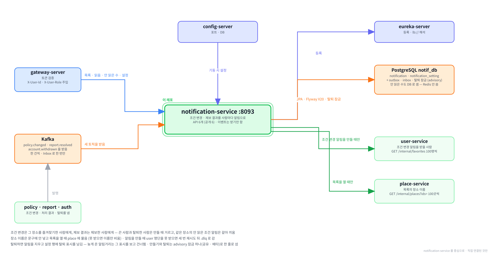

# notification-service

**함께하개**는 반려동물과 함께 갈 수 있는 장소를 찾고, 우리 아이가 그곳에
들어갈 수 있는지 판정해 주는 서비스입니다.

이 저장소는 그중 **알림을 만들어 두고 보여 주는 서버**입니다.
즐겨찾기한 장소의 동반 조건이 바뀌거나, 올린 제보를 관리자가 처리하면 그 사람 앞으로 알림을 한 건 만들어 둡니다.
사용자는 헤더의 벨에서 안 읽은 수를 보고, 목록을 열어 읽습니다.
알림을 만드는 계기는 전부 다른 서비스가 낸 이벤트이고, 이 서비스는 이벤트를 받기만 할 뿐 내지는 않습니다.

---

**먼저 전체 그림을 보고, 이 레포가 그 안 어디에 있는지 본 뒤 읽습니다.**

**① 전체 구조 — 층으로 본 것.** 위에서 아래로 요청이 내려가고, 어느 층에 무엇이 있는지.


**② 전체 구조 — 서비스끼리 무엇을 주고받는지.** 초록 실선이 `/internal` 호출, Kafka 표가 이벤트, 하늘색 점선이 VPC 경계.


**③ 이 레포를 중심으로.** 직접 연결된 것만 남긴 그림.



<br><br>

---

## 본문 시작

<br><br>

---

## 먼저 알아 두면 좋은 것

이 문서에 자주 나오는 말 4가지입니다. 더 자세한 설명은 [service-template 의 용어 장](https://github.com/paw-trail/service-template#11-용어)에 있습니다.

**게이트웨이가 넣어 주는 헤더 2개.** 브라우저의 요청은 게이트웨이(gateway-server)를 거치며 로그인 토큰을 검사받고,
게이트웨이가 `X-User-Id`(계정 식별자)와 `X-User-Role`(`USER` 또는 `ADMIN`)을 붙여 이 서비스로 넘깁니다.
이 서비스는 그 헤더 2개만 보고 누가 부르는지 압니다. 그래서 알림은 늘 "헤더에 적힌 그 사람의 것" 만 보이고 고쳐집니다.
로컬에서 게이트웨이를 거치지 않고 직접 부를 때는 이 둘을 손으로 싣습니다([1-8](#1-8-첫-알림-만들어-보기)).

**Inbox.** 카프카는 같은 메시지를 두 번 건넬 수 있습니다. 받은 이벤트의 식별자를 `processed_event` 표에 적어 두고,
이미 적혀 있으면 건너뜁니다. 적는 일과 알림을 만드는 일이 한 트랜잭션이라 둘 중 하나만 남는 일이 없습니다([6장](#6-이벤트)).

**소비 그룹과 오프셋.** 이 서비스는 `notification-service` 라는 이름으로 카프카에서 메시지를 읽고,
토픽마다 "어디까지 읽었나" 를 오프셋으로 남깁니다. 처음 뜰 때 남긴 오프셋이 없으면 토픽의 맨 앞부터 읽기 때문에,
개발용 카프카에 쌓인 이벤트를 한꺼번에 받게 됩니다. 처음 한 번은 오프셋을 끝으로 옮겨 두고 띄웁니다([1-5](#1-5-처음-띄울-때--쌓인-이벤트-건너뛰기)).

**advisory 잠금.** PostgreSQL 이 주는 "이름표 잠금" 입니다. 표의 행을 잠그지 않고, 정한 번호 하나를 여러 트랜잭션이 함께 잡거나(공유) 혼자 잡습니다(배타).
트랜잭션이 끝나면 저절로 풀립니다. 이 서비스는 알림을 만드는 일과 탈퇴를 정리하는 일이 겹치지 않게 하는 데 씁니다([7-4](#7-4-탈퇴-잠금)).

<br><br>

---

## 0. 이 서비스가 하는 일

### 0-1. 한 문장

**다른 서비스가 알려 온 일 가운데 사람이 알아야 할 것을 그 사람 앞으로 알림 한 건씩 만들어 두고, 화면이 달라고 할 때 보여 줍니다.**

알림 목록을 부르면 이런 모양이 돌아옵니다. 식별자 · 장소 · 문구는 실물 확인 때 쓴 값이고, 시각과 `traceId` 는 예시입니다.

```json
{
  "code": "SUCCESS",
  "message": "요청이 성공적으로 처리되었습니다.",
  "data": {
    "content": [
      {
        "notificationId": "01a0bb00-0000-7000-8000-000000000002",
        "notifType": "REPORT_RESOLVED",
        "placeId": "01a09015-85d7-77b4-8e39-690bb150ded0",
        "placeName": "옥토끼우주센터",
        "title": "제보하신 내용이 반영되었습니다",
        "body": "전화번호를 새 번호로 고쳤습니다",
        "readAt": null,
        "createdAt": "2026-09-20T07:42:47.512"
      },
      {
        "notificationId": "01a0bb00-0000-7000-8000-000000000001",
        "notifType": "POLICY_CHANGED",
        "placeId": "01a09015-8474-78f6-828e-aaad9cffa975",
        "placeName": "[북악하늘길 스카이웨이] 하늘한마당~하늘마루",
        "title": "동반 조건이 바뀌었습니다",
        "body": "체중 제한 · 크기 제한",
        "readAt": null,
        "createdAt": "2026-09-20T07:41:47.512"
      }
    ],
    "page": { "number": 0, "size": 20, "totalElements": 2, "totalPages": 1 }
  },
  "traceId": "6aaf105fd6ceb5a6ea991127e208172f"
}
```

카드를 누르면 화면은 `placeId` 로 장소 상세를 엽니다. 2종류 모두 같습니다.

### 0-2. 다른 서비스와의 자리

```
policy ─── policy.changed ────┐
report ─── report.resolved ───┼──▶  notification-service  ──▶  notif_db
auth ───── account.withdrawn ─┘          ▲        │
                                         │        ├──▶  user   GET /internal/favorites
화면 ── gateway ── 목록 · 읽음 · 설정 ───┘        └──▶  place  GET /internal/places?ids=
```

| 상대 | 주고받는 것 | 언제 |
|---|---|---|
| policy | `policy.changed` 를 받음 | 장소의 동반 조건 값이 바뀔 때 |
| report | `report.resolved` 를 받음 | 관리자가 제보를 승인 · 반려할 때 |
| auth | `account.withdrawn` 을 받음 | 사용자가 탈퇴할 때 |
| user | `GET /internal/favorites?placeId=` 를 부름 | 조건 변경 알림을 받을 사람을 모을 때만 |
| place | `GET /internal/places?ids=` 를 부름 | 목록을 열 때만 — 장소 이름을 채움 |
| gateway | 공개 API 6개가 들어옴 | 헤더 벨 · 알림 목록 · 알림 설정 화면 |

알림을 만들 때 place 는 부르지 않습니다. 제보 결과 알림은 누구도 부르지 않고, 조건 변경 알림만 user 에 명단을 묻습니다.

### 0-3. 무엇이 들어 있나

| 들어 있는 것 | 자세히 |
|---|---|
| 알림 2종류를 이벤트로 만들기 — 조건 변경 · 제보 결과 | [2장](#2-알림-2종류와-문구) · [3장](#3-받는-사람) |
| 목록 · 읽음 · 모두 읽음 · 안 읽은 수 | [4장](#4-목록--읽음--안-읽은-수) |
| 알림 종류마다 받을지 정하는 수신 설정 | [5장](#5-수신-설정) |
| 탈퇴한 사람의 알림 정리와 순서 방어 | [7장](#7-탈퇴와-순서) |

| 들어 있지 않은 것 | 까닭 |
|---|---|
| 푸시 · 메일 · 문자 발송 | 알림은 이 서비스의 표에 쌓이고 화면이 가져갑니다 |
| 실시간 전달(SSE · 웹소켓) | 헤더 벨은 30초~1분마다 안 읽은 수를 물어봅니다 — 실시간일 이유가 없습니다 |
| 이벤트 발행 | 알림은 끝단이라 알릴 상대가 없습니다. `outbox` 표는 공통 번호대로 생기지만 쓰지 않습니다 |
| 관리자 API | 사람이 알림을 손으로 쓰거나 고치는 경로가 없습니다 |
| 오래된 알림 정리 | 필요해지면 그때 만듭니다([15장](#15-아직-안-한-것)) |
| Redis | 안 읽은 수도 DB 로 셉니다. 한 사람의 알림이라 수가 적습니다 |

### 0-4. 6가지만 기억하면 됩니다

| # | 기억할 것 | 자세히 |
|---|---|---|
| 1 | 알림은 이벤트 3개로만 생깁니다. API 로 만드는 길은 없습니다 | [6장](#6-이벤트) |
| 2 | 장소 이름은 문구에 넣지 않고 목록을 열 때 place 에 묻습니다 | [2-5](#2-5-장소-이름은-문구에-넣지-않습니다) |
| 3 | 받을 사람은 만들 때 거릅니다 — 끈 사람 · 탈퇴한 사람은 알림 행이 안 생깁니다 | [3-3](#3-3-설정으로-거릅니다) |
| 4 | 같은 장소의 안 읽은 조건 알림은 새 알림으로 갈아 끼웁니다 | [3-4](#3-4-같은-장소면-갈아-끼웁니다) |
| 5 | 탈퇴하면 알림은 지우고 설정 행에 탈퇴 표시를 남깁니다 | [7장](#7-탈퇴와-순서) |
| 6 | 처음 띄울 때 쌓인 이벤트를 건너뛰려면 오프셋을 끝으로 옮깁니다 | [1-5](#1-5-처음-띄울-때--쌓인-이벤트-건너뛰기) |

### 0-5. 화면에서 어디에 쓰이나

| 화면 | 부르는 것 | 비고 |
|---|---|---|
| 헤더 벨의 숫자 | `GET /api/v1/notifications/unread-count` | 30초~1분마다. DB 만 봅니다 |
| 알림 목록 | `GET /api/v1/notifications` | 최신순 · 쪽 단위. 장소 이름이 비면 "장소 이름을 불러오지 못했습니다" 로 안내 |
| 알림 한 건을 누름 | `PATCH /api/v1/notifications/{notificationId}/read` → 장소 상세 | 이미 읽었어도 200 |
| 모두 읽음 버튼 | `PATCH /api/v1/notifications/read-all` | 읽을 것이 없어도 200 |
| 마이페이지 알림 설정 | `GET` · `PATCH /api/v1/notifications/settings` | 토글 2개 — 조건 변경 · 제보 결과 |

<br><br>

---

## 1. 로컬에서 띄우기

### 1-1. 전체 흐름

| 차례 | 할 일 | 절 |
|---|---|---|
| 1 | 인프라 컨테이너를 띄웁니다 — PostgreSQL · Kafka · 설정 서버 · 유레카 · 게이트웨이 | [1-2](#1-2-인프라-컨테이너) |
| 2 | 재료 서비스를 띄웁니다 — user · place | [1-3](#1-3-재료-서비스) |
| 3 | 이미지를 받거나 굽습니다 | [1-4](#1-4-이미지-준비) |
| 4 | 처음이면 쌓인 이벤트를 건너뛰도록 오프셋을 옮깁니다 | [1-5](#1-5-처음-띄울-때--쌓인-이벤트-건너뛰기) |
| 5 | 띄웁니다 | [1-6](#1-6-실행) |
| 6 | 떴는지 봅니다 | [1-7](#1-7-떴는지-확인) |
| 7 | 알림 하나를 심어 목록 · 읽음을 불러 봅니다 | [1-8](#1-8-첫-알림-만들어-보기) |

### 1-2. 인프라 컨테이너

infra 레포의 compose 를 씁니다. `.env` 의 `COMPOSE_PROFILES` 에 `infra` · `db` · `platform` · `app` 이 들어 있어야 합니다.

| 컨테이너 | 이 서비스가 쓰는 것 |
|---|---|
| `pawtrail-postgres` | `notif_db` (계정 `notif_svc`) — 처음 뜰 때 init 스크립트가 만들어 둡니다 |
| `pawtrail-kafka` | 받는 토픽 3개와 `.dlq` 3개 — infra 가 미리 만들어 둡니다 |
| `pawtrail-config-server` | 포트 · DB 주소 · 카프카 주소 |
| `pawtrail-eureka-server` | 등록 · `lb://user-service` · `lb://place-service` 를 풉니다 |
| `pawtrail-gateway-server` | 화면에서 오는 요청 — `/api/v1/notifications/**` 라우트가 이미 있습니다 |

Redis 는 쓰지 않습니다.

### 1-3. 재료 서비스

| 서비스 | 없으면 |
|---|---|
| user | 조건 변경 알림을 받을 사람을 못 모읍니다. 세 번 재시도한 뒤 그 이벤트는 `policy.changed.dlq` 로 가고 알림이 안 생깁니다([3-5](#3-5-명단을-못-받으면)) |
| place | 목록은 그대로 나오고 장소 이름만 `null` 이 됩니다([4-3](#4-3-장소-이름-채우기)) |
| policy · report · auth | 이벤트를 내는 쪽입니다. 없으면 새 알림이 안 생길 뿐 이 서비스는 멀쩡합니다 |

### 1-4. 이미지 준비

릴리스된 이미지는 ghcr 에 있습니다. infra 레포에서 받습니다.

```bash
docker compose pull notification-service
```

코드를 고쳐 가며 볼 때는 이 레포에서 구워 같은 이름으로 덮습니다. Windows · macOS 모두 같습니다.

```bash
./gradlew clean bootJar
docker build -t ghcr.io/paw-trail/notification-service:latest .
```

구운 이미지를 쓸 때는 [1-6](#1-6-실행) 에서 `--pull never` 를 붙여, 받으러 가지 말고 방금 구운 것을 쓰게 합니다.

### 1-5. 처음 띄울 때 — 쌓인 이벤트 건너뛰기

**왜 필요한가.** 공통 설정이 `auto-offset-reset: earliest` 라, 이 서비스가 처음 뜨면 토픽 3개를 맨 앞부터 읽습니다.
개발용 카프카에는 적재를 돌린 흔적이 쌓여 있습니다. 2026-09-20 에 잰 값으로 `policy.changed` 만 15,023건이었습니다.
그대로 띄우면 옛 변경마다 즐겨찾기 명단을 묻고 알림을 만들어, 확인하려던 알림이 그 사이에 묻힙니다.

**무엇을 하나.** 이 서비스의 소비 그룹이 아직 없을 때(또는 멈춰 있을 때) 토픽 3개의 오프셋을 끝으로 옮겨 둡니다.
그룹이 없어도 옮길 수 있습니다. 한 번 옮기면 그 뒤로는 거기서부터 읽습니다.

**언제.** 처음 띄우기 전에 한 번입니다. 이미 떠 있다면 먼저 멈춥니다 — 붙어 있는 그룹은 옮길 수 없습니다.

```bash
docker compose stop notification-service
```

먼저 어디로 옮길지만 봅니다(`--dry-run`). Windows · macOS 모두 같습니다.

```bash
docker exec pawtrail-kafka /opt/kafka/bin/kafka-consumer-groups.sh --bootstrap-server localhost:9092 --group notification-service --topic policy.changed --topic report.resolved --topic account.withdrawn --reset-offsets --to-latest --dry-run
```

토픽 3개 × 파티션 3개로 9줄이 나오고 `NEW-OFFSET` 이 각 파티션의 끝입니다. 맞으면 `--dry-run` 을 `--execute` 로 바꿔 한 번 더 돌립니다.

```bash
docker exec pawtrail-kafka /opt/kafka/bin/kafka-consumer-groups.sh --bootstrap-server localhost:9092 --group notification-service --topic policy.changed --topic report.resolved --topic account.withdrawn --reset-offsets --to-latest --execute
docker exec pawtrail-kafka /opt/kafka/bin/kafka-consumer-groups.sh --bootstrap-server localhost:9092 --describe --group notification-service
```

마지막 줄은 `Consumer group 'notification-service' has no active members.` 뒤에 9줄이 나오고, 전부 `CURRENT-OFFSET` 과 `LOG-END-OFFSET` 이 같아 `LAG 0` 이어야 합니다.

`--dry-run` 에서 그룹이 비어 있지 않다(`Stable`)는 말이 나오면 누군가 이 그룹으로 붙어 있는 것입니다. IntelliJ 로 띄운 이 서비스가 흔한 경우입니다. 멈추고 다시 합니다.

### 1-6. 실행

infra 레포에서 띄웁니다. 의존하는 컨테이너(설정 서버 · PostgreSQL · Kafka)가 healthy 가 된 뒤에 뜹니다.

```bash
docker compose up -d notification-service
```

이미지를 새로 구워 바꿔 끼울 때는 이 서비스만 다시 만듭니다.

```bash
docker compose up -d --no-deps --force-recreate --pull never notification-service
```

`--force-recreate` 는 반드시 `--no-deps` 와 함께 씁니다. 빼면 의존 컨테이너까지 다시 만들 수 있는데,
Kafka 는 볼륨이 없어 토픽과 [1-5](#1-5-처음-띄울-때--쌓인-이벤트-건너뛰기) 에서 옮긴 오프셋이 통째로 사라집니다([14-4](#14-4---force-recreate-가-kafka-까지-다시-만듭니다)).

### 1-7. 떴는지 확인

healthy · 유레카 UP 을 기다린 뒤 봅니다. 갈아 끼운 직후 바로 물으면 유레카에 옛 인스턴스의 `DOWN` 한 줄만 보일 수 있습니다.

Windows (PowerShell 7)

```powershell
$i = 0; while ((docker inspect -f "{{.State.Health.Status}}" pawtrail-notification-service) -ne "healthy" -and $i -lt 60) { Start-Sleep -Seconds 3; $i++ }; "health: " + (docker inspect -f "{{.State.Health.Status}}" pawtrail-notification-service)
$i = 0; do { Start-Sleep -Seconds 3; $i++; $st = try { (curl.exe -s "http://localhost:8761/eureka/apps/NOTIFICATION-SERVICE" -H "Accept: application/json" | ConvertFrom-Json).application.instance.status } catch { $null } } until (($st -contains "UP") -or $i -ge 40); "eureka: $st"
docker logs pawtrail-notification-service 2>&1 | Select-String -Pattern "now at version","Started NotificationApplication","partitions assigned"
```

macOS · Linux

```bash
until [ "$(docker inspect -f '{{.State.Health.Status}}' pawtrail-notification-service)" = "healthy" ]; do sleep 3; done; echo healthy
until curl -s -H "Accept: application/json" http://localhost:8761/eureka/apps/NOTIFICATION-SERVICE | grep -q '"status":"UP"'; do sleep 3; done; echo "eureka UP"
docker logs pawtrail-notification-service 2>&1 | grep -E "now at version|Started NotificationApplication|partitions assigned"
```

| 볼 것 | 정상 |
|---|---|
| health · 유레카 | `healthy` · `UP` (옆에 방금 내린 인스턴스의 `DOWN` 이 잠깐 붙어도 됩니다) |
| Flyway | `now at version v20` — 공통 V1 · V2 와 이 서비스의 V20 |
| 기동 | `Started NotificationApplication in 11.0 seconds` 안팎 |
| 카프카 | `partitions assigned` 3줄 — `policy.changed` · `report.resolved` · `account.withdrawn` |

### 1-8. 첫 알림 만들어 보기

알림은 이벤트로만 생기므로, 여기서는 가짜 계정 앞으로 SQL 로 한 건을 심고 공개 API 를 직접 불러 봅니다.
게이트웨이를 거치지 않으니 헤더 2개를 손으로 싣습니다. 가짜 장소라 목록의 장소 이름은 `null` 로 나옵니다.

| 값 | 쓰는 것 |
|---|---|
| 계정 | `00000000-0000-7000-8000-0000000000a1` (가짜) |
| 장소 | `00000000-0000-7000-8000-0000000000b1` (가짜 — place 에 없음) |
| 알림 | `00000000-0000-7000-8000-0000000000c1` |

Windows (PowerShell 7)

```powershell
$sql = @'
INSERT INTO notification (id, account_id, notif_type, place_id, title, body, created_at, created_by, updated_at, updated_by)
VALUES ('00000000-0000-7000-8000-0000000000c1', '00000000-0000-7000-8000-0000000000a1', 'POLICY_CHANGED', '00000000-0000-7000-8000-0000000000b1', '동반 조건이 바뀌었습니다', '목줄', now(), 'TEST', now(), 'TEST');
'@
$sql | docker exec -i pawtrail-postgres psql -U notif_svc -d notif_db
$h = @("-H", "X-User-Id: 00000000-0000-7000-8000-0000000000a1", "-H", "X-User-Role: USER")
curl.exe -s "http://localhost:8093/api/v1/notifications/unread-count" @h
curl.exe -s "http://localhost:8093/api/v1/notifications" @h
curl.exe -s -X PATCH "http://localhost:8093/api/v1/notifications/00000000-0000-7000-8000-0000000000c1/read" @h
curl.exe -s "http://localhost:8093/api/v1/notifications/unread-count" @h
docker exec pawtrail-postgres psql -U notif_svc -d notif_db -c "DELETE FROM notification WHERE account_id = '00000000-0000-7000-8000-0000000000a1';"
```

macOS · Linux

```bash
docker exec -i pawtrail-postgres psql -U notif_svc -d notif_db << 'SQL'
INSERT INTO notification (id, account_id, notif_type, place_id, title, body, created_at, created_by, updated_at, updated_by)
VALUES ('00000000-0000-7000-8000-0000000000c1', '00000000-0000-7000-8000-0000000000a1', 'POLICY_CHANGED', '00000000-0000-7000-8000-0000000000b1', '동반 조건이 바뀌었습니다', '목줄', now(), 'TEST', now(), 'TEST');
SQL
H=(-H "X-User-Id: 00000000-0000-7000-8000-0000000000a1" -H "X-User-Role: USER")
curl -s "http://localhost:8093/api/v1/notifications/unread-count" "${H[@]}"
curl -s "http://localhost:8093/api/v1/notifications" "${H[@]}"
curl -s -X PATCH "http://localhost:8093/api/v1/notifications/00000000-0000-7000-8000-0000000000c1/read" "${H[@]}"
curl -s "http://localhost:8093/api/v1/notifications/unread-count" "${H[@]}"
docker exec pawtrail-postgres psql -U notif_svc -d notif_db -c "DELETE FROM notification WHERE account_id = '00000000-0000-7000-8000-0000000000a1';"
```

안 읽은 수가 `{"unreadCount":1}` → 목록에 한 건(`placeName` 은 `null`) → 읽음 `200` · `data` 없음 → `{"unreadCount":0}` → `DELETE 1` 순서로 나오면 됩니다.
PowerShell 에서 SQL 을 명령줄 인자로 넘기지 않고 흘려보내는 까닭은 한글과 따옴표가 인자에서 깨질 수 있어서입니다([14-5](#14-5-powershell-에서-한글과-따옴표가-깨집니다)).

<br><br>

---

## 2. 알림 2종류와 문구

### 2-1. 2종류

| `notifType` | 계기가 되는 이벤트 | 받는 사람 | 가리키는 장소 |
|---|---|---|---|
| `POLICY_CHANGED` | `policy.changed` — 값이 바뀐 조건 칸이 있을 때 | 그 장소를 즐겨찾기한 사람 전부 | 조건이 바뀐 장소 |
| `REPORT_RESOLVED` | `report.resolved` — 관리자가 승인하거나 반려했을 때 | 제보한 사람 한 명 | 제보한 장소 (후기 신고는 그 후기가 달린 장소) |

`policy.changed` 는 조건 값이 그대로여도 나갈 때가 있습니다. 충돌 여부 · 정정 출처 · 근거만 바뀐 경우인데,
그때는 `changedFields` 가 비어 오고, 사람에게 알릴 것이 없어 알림을 만들지 않습니다.

종류는 코드값 그대로 응답에 실리고, 아이콘은 화면이 고릅니다. 2종류 모두 알림을 누르면 `placeId` 의 장소 상세로 갑니다.

### 2-2. 제목

| 경우 | 제목 |
|---|---|
| 조건 변경 · 판 1 | 동반 조건이 새로 확인되었습니다 |
| 조건 변경 · 판 2 이상 | 동반 조건이 바뀌었습니다 |
| 제보 결과 · 반려 (유형과 무관) | 제보하신 내용은 반영되지 않았습니다 |
| 제보 결과 · 후기 신고(`REVIEW_ABUSE`) 승인 | 신고하신 후기가 처리되었습니다 |
| 제보 결과 · 그 밖의 승인 | 제보하신 내용이 반영되었습니다 |

**판 1 을 따로 둔 까닭.** 장소는 먼저 생기고 동반 조건은 나중에 읽혀 들어옵니다. 그 사이에 즐겨찾기를 한 사람이 있을 수 있는데,
판 1 은 빈 조건과 비교한 값이라 "바뀌었다" 가 틀린 말이 됩니다.

**모르는 값이 오면.** 유형 · 결과를 문자열로 받습니다. report 가 유형을 늘려도 여기가 깨지지 않게 하려는 것입니다.
모르는 유형의 승인은 "반영되었습니다" 로 알리고, 승인도 반려도 아닌 결과는 알릴 말이 없어 알림을 만들지 않고 경고를 남깁니다.

```java
// NotificationText.reportResolved — 제목을 고르는 자리
if ("REJECTED".equals(status)) {
    title = REPORT_REJECTED_TITLE;
} else if ("ACCEPTED".equals(status)) {
    title = "REVIEW_ABUSE".equals(reportType) ? REVIEW_ACCEPTED_TITLE : REPORT_ACCEPTED_TITLE;
} else {
    return Optional.empty();
}
```

말투는 모두 `~습니다` 입니다.

### 2-3. 조건 변경 알림의 본문

바뀐 조건 칸의 이름표를 받은 차례(조건 순서)대로 적습니다. 3개까지 적고 나머지는 "외 N개" 로 셉니다.

| `changedFields` | 본문 |
|---|---|
| `[leashRequired]` | 목줄 |
| `[maxWeightKg, sizeRule]` | 체중 제한 · 크기 제한 |
| `[maxWeightKg, sizeRule, leashRequired, carrierRequired, vaccineProof]` | 체중 제한 · 크기 제한 · 목줄 외 2개 |
| `[maxWeightKg, dogPark]` (`dogPark` 은 모르는 칸) | 체중 제한 외 1개 |
| `[dogPark, catCafe]` (전부 모르는 칸) | 조건 2개 |

이름표는 policy 가 정한 조건 20칸의 이름표와 글자까지 같습니다. 사용자가 알림을 누르면 장소 상세에서 policy 의 조건 칸 이름을 보게 되므로,
같은 칸은 같은 말이어야 합니다. 이름표 사본은 `ConditionField` 에 있습니다.

| 칸 | 이름표 | 칸 | 이름표 |
|---|---|---|---|
| `scope` | 동반 범위 | `leashRequired` | 목줄 |
| `guideDogOnly` | 안내견 한정 | `excludedZones` | 동반 불가 구역 |
| `petOnly` | 반려견 동반 전용 | `allowedZonesOnly` | 동반 가능 구역 |
| `indoorAllowed` | 실내 동반 | `excludedDays` | 동반 불가일 |
| `outdoorAllowed` | 실외 동반 | `extraFeeAmount` | 추가 요금 |
| `maxWeightKg` | 체중 제한 | `extraFeeUnit` | 요금 기준 |
| `weightInclusive` | 체중 기준 | `requiredItems` | 준비물 |
| `maxCount` | 마릿수 제한 | `vaccineProof` | 접종 증명 |
| `sizeRule` | 크기 제한 | `advanceInquiry` | 사전 문의 |
| `breedRule` | 견종 제한 | `carrierRequired` | 이동장 |

**policy 가 칸을 늘리면.** 레포가 서로 달라 자동으로 맞춰 보지 못합니다. `ConditionField` 에 한 줄을 더하면 되고,
더하지 않아도 그 칸은 이름 대신 "외 N개" 의 수에만 들어갈 뿐 알림이 깨지지는 않습니다.
verdict 의 `ConditionField` 도 같은 사본이라 함께 고칩니다.

값은 적지 않습니다. `policy.changed` 가 칸 이름만 싣고 값을 싣지 않기 때문이고, 알림을 누르면 가는 장소 상세가 늘 지금 조건 전부를 보여 줍니다.

### 2-4. 제보 결과 알림의 본문

관리자가 처리할 때 쓴 메모를 **그대로** 본문에 싣습니다. 앞뒤에 아무것도 붙이지 않습니다.
그래서 관리자 화면의 메모는 사용자가 읽는 글입니다.

| 메모 | 본문 |
|---|---|
| 보통 | 메모 그대로 |
| 비어 있음 | 처리 결과를 확인해 주세요 |
| 500자를 넘음 | 앞 499자 + `…` (이모지처럼 2칸짜리 문자는 반으로 가르지 않고 그 앞에서 자름) |

report 가 처리 요청에서 메모를 필수 · 500자까지로 받아서 비거나 넘치는 메모는 지금 오지 않습니다.
그래도 받는 쪽에서 막는 까닭은, 그대로 두면 알림을 만들 때 예외가 나 재시도해도 같고, 결국 그 결과 알림을 영영 잃기 때문입니다.
사용자에게 중요한 것은 반영됐는지(제목)입니다. 어느 경우든 경고 로그를 남깁니다([12-3](#12-3-로그-읽는-법)).

### 2-5. 장소 이름은 문구에 넣지 않습니다

문구에는 "동반 조건이 바뀌었습니다" 처럼 장소 이름이 없습니다. 이름은 목록을 열 때 place 에서 받아 `placeName` 칸에 채웁니다([4-3](#4-3-장소-이름-채우기)).

| 문구에 넣으면 생기는 일 | 목록 때 채우면 |
|---|---|
| 장소 이름이 바뀌어도 알림에는 옛 이름이 남음 | 늘 지금 이름 |
| 제목은 100자인데 장소 이름은 200자까지라 자르게 됨 | 자를 일이 없음 |
| 알림을 만들 때마다 place 를 불러야 함 — place 가 멈추면 알림 만들기도 멈춤 | 만들 때는 place 를 안 부름 |
| `report.resolved` 에는 이름이 실려 오지 않음 | 2종류가 같은 방법으로 채워짐 |

대가는 목록을 열 때 place 를 한 번 부르는 것입니다. 한 쪽 20건이면 한 번이고, 자주 불리는 안 읽은 수는 place 를 부르지 않습니다.

<br><br>

---

## 3. 받는 사람

### 3-1. 한눈에

**조건 변경 (`policy.changed`)**

| 차례 | 하는 일 |
|---|---|
| 1 | 바뀐 칸이 없으면 끝 |
| 2 | 탈퇴 잠금을 공유로 잡음 ([7-4](#7-4-탈퇴-잠금)) |
| 3 | user 에서 즐겨찾기 명단을 100명씩 끝 쪽까지 받음 — 쪽마다 수신 설정을 한 번 읽어 받을 사람만 남김 |
| 4 | 다 모은 뒤 100명씩, 그 장소의 안 읽은 조건 알림을 지우고 새 알림을 씀 |

**제보 결과 (`report.resolved`)**

| 차례 | 하는 일 |
|---|---|
| 1 | 문구를 지음 — 알릴 말이 없는 결과면 끝 |
| 2 | 탈퇴 잠금을 공유로 잡음 |
| 3 | 제보한 사람의 수신 설정을 봄 — 껐거나 탈퇴 표시면 끝 |
| 4 | 알림 한 건을 씀 |

어느 경우든 이벤트 하나가 한 트랜잭션입니다. 받은 이벤트를 적는 Inbox 가 트랜잭션을 열고 그 안에서 위 일을 하므로,
알림이 다 들어가거나 하나도 안 들어갑니다.

```java
// NotificationCreateService.notifyPolicyChanged — 뼈대만
if (changedFields == null || changedFields.isEmpty()) {
    return;                                            // 1
}
withdrawalLockRepository.lockForCreation();            // 2
while (true) {                                         // 3
    FavoritePage favoritePage = userProvider.findFavoriteAccountIds(placeId, page);
    recipients.addAll(receiversOf(favoritePage.accountIds(), NotifType.POLICY_CHANGED));
    if (favoritePage.last()) break;
    page++;
}
for (int from = 0; from < recipients.size(); from += WRITE_CHUNK) {   // 4
    List<UUID> chunk = recipients.subList(from, Math.min(from + WRITE_CHUNK, recipients.size()));
    notificationRepository.deleteUnreadPolicyChanged(chunk, placeId);
    notificationRepository.saveAll(/* chunk 의 사람마다 새 알림 */);
}
```

### 3-2. 명단을 100명씩 끝까지 받습니다

user 의 `GET /internal/favorites?placeId=&page=&size=100` 을 첫 쪽부터 마지막 쪽까지 부릅니다.

| 무엇 | 까닭 |
|---|---|
| 100명씩 | user 의 기본값과 같습니다. 인기 장소면 즐겨찾기가 수천 명일 수 있는데 100명씩이면 수십 번에 끝납니다 |
| 끝 쪽까지 | 응답의 `totalPages` 로 마지막 쪽을 가립니다. 전체가 0명이면 첫 쪽이 곧 마지막 쪽입니다 |
| 쪽 사이에 빠지거나 겹치지 않음 | user 가 즐겨찾기 식별자 순으로 돌려줍니다. 식별자가 UUID 버전 7 이라 순서가 고정입니다 |
| 다 모은 뒤에 씀 | 중간 쪽에서 user 가 멈추면 아무것도 안 쓴 채 이벤트를 처음부터 다시 처리합니다 |
| 쓸 때도 100명씩 | 한 문장에 식별자를 너무 많이 실으면 PostgreSQL 드라이버의 바인딩 수 한도(32,767)에 걸립니다 |

명단에는 계정 식별자만 옵니다. 담은 시각이나 메모는 알림에 쓰이지 않습니다.

### 3-3. 설정으로 거릅니다

명단 한 쪽마다 수신 설정 표를 한 번 읽고(`account_id IN (…)`), 사람마다 이렇게 가릅니다.

| 그 사람의 설정 행 | 결과 |
|---|---|
| 없음 | 받음 — 행이 없으면 전부 받는 것으로 봅니다 |
| 이 종류를 끔 | 건너뜀 |
| 탈퇴 표시가 찍혀 있음 | 건너뜀 — 탈퇴보다 늦게 도착한 알림거리입니다([7-3](#7-3-늦게-온-알림거리)) |

**보여 줄 때가 아니라 만들 때 거르는 까닭.** 설정의 뜻은 "앞으로 받을지" 입니다.

| 만들 때 거름 (지금) | 보여 줄 때 거르면 |
|---|---|
| 끈 동안의 알림은 행이 안 생김 | 행은 늘 생기고 목록 · 안 읽은 수가 설정과 조인해야 함 |
| 다시 켜도 쌓인 알림이 한꺼번에 뜨지 않음 | 다시 켜는 순간 끈 동안의 알림이 한꺼번에 나타남 |
| 30초마다 불리는 안 읽은 수가 설정을 안 봄 | 폴링마다 조인 |
| 이미 받은 알림은 그대로 | — |

끌 때 이미 받은 알림을 지우거나 숨기지 않습니다. 읽음 · 모두 읽음으로 정리할 몫이고, 지우면 되돌릴 수 없기 때문입니다.

### 3-4. 같은 장소면 갈아 끼웁니다

받을 사람에게 **그 장소로 나간 안 읽은 조건 알림**이 이미 있으면 지우고 새 알림 한 건을 씁니다.

| 결과 | |
|---|---|
| 안 읽은 수 | 그대로 — 지운 만큼 새로 씀 |
| 목록 | 새 알림이 맨 위로 |
| 본문 | 이번 변경의 칸만 — 앞 변경의 칸 이름은 덮임 |
| 읽은 알림 | 그대로 둠 — 이미 본 것이라 겹쳐 보이지 않음 |
| 제보 결과 알림 | 갈아 끼우지 않음 — 제보마다 한 건 |

**까닭.** 같은 장소의 조건이 짧은 사이 거듭 바뀌는 일이 실제로 있습니다. 적재를 다시 돌리면 같은 장소에 판이 연달아 오르는데,
적재를 두 번 돌린 이틀 사이 같은 장소에 다시 오른 판이 2,170번이었습니다. 그때마다 한 줄씩 쌓이면 목록이 한 장소로 도배됩니다.
앞 변경의 칸 이름이 덮이는 대가는 받아들였습니다. 알림을 누르면 가는 장소 상세가 늘 지금 조건 전부를 보여 줍니다.

실물로 본 흐름은 이렇습니다. 같은 사람 · 같은 장소에 판이 2 → 3 → 4 로 올랐습니다.

| 판 | `changedFields` | 로그 | 목록 (한 줄) |
|---|---|---|---|
| 2 | `[advanceInquiry]` | 알림 1건, 갈아 끼움 0건 | 사전 문의 |
| 3 | `[vaccineProof]` | 알림 1건, 갈아 끼움 1건 | 접종 증명 |
| 4 | `[vaccineProof, advanceInquiry]` | 알림 1건, 갈아 끼움 1건 | 접종 증명 · 사전 문의 |

지우기는 한 문장으로 합니다. 같은 트랜잭션에서 앞서 쓴 알림이 아직 DB 에 안 들어갔으면 그 문장이 못 보므로, 밀린 쓰기를 먼저 반영하고 지웁니다.

```java
// NotificationJpaRepository
@Modifying(flushAutomatically = true)
@Query("""
        delete from Notification n
        where n.accountId in :accountIds
          and n.placeId = :placeId
          and n.notifType = :notifType
          and n.readAt is null
        """)
int deleteUnread(@Param("accountIds") Collection<UUID> accountIds,
                 @Param("placeId") UUID placeId,
                 @Param("notifType") NotifType notifType);
```

### 3-5. 명단을 못 받으면

user 가 멈춰 명단을 못 받으면 예외를 그대로 올립니다. place 처럼 `null` 로 삼키지 않습니다.
이름은 비워도 목록이 서지만, 명단은 비우면 알림을 받을 사람이 사라지기 때문입니다.

| 차례 | 일어나는 일 |
|---|---|
| 1 | 트랜잭션이 되돌아가 아무것도 안 남음 — 받은 이벤트 기록(Inbox)도 함께 되돌아감 |
| 2 | 공통 오류 처리기가 1초 · 2초 · 4초 간격으로 세 번 다시 처리 |
| 3 | 끝내 안 되면 원본을 `policy.changed.dlq` 로 보내고 다음 메시지로 넘어감 |

**대가.** user 가 7초 넘게 멈춘 동안(재배포 등) 들어온 조건 변경은 알림이 만들어지지 않습니다.
조건 알림은 놓쳐도 사실이 틀어지지 않습니다 — 장소 상세와 판정은 늘 지금 조건을 보여 줍니다.
`.dlq` 에 원본이 남아 있으니 필요하면 손으로 다시 흘릴 수 있습니다([12-5](#12-5-dlq-에-간-이벤트)).

로그에는 어느 장소 몇 쪽에서 멈췄는지가 남습니다.

```
즐겨찾기 명단을 받지 못했습니다: placeId=01a09015-8474-78f6-828e-aaad9cffa975, page=0
```

### 3-6. 제보 결과는 한 사람에게

제보 결과 알림은 다른 서비스를 부르지 않습니다. 받는 사람(`accountId`)과 장소(`placeId`)가 이벤트에 다 실려 옵니다.
그 사람의 설정 행을 한 번 보고, 행이 없거나 켜져 있으면 한 건을 씁니다.

| 설정 행 | 로그 |
|---|---|
| 없음 · 켜짐 | `제보 결과 알림을 만들었습니다: notificationId=…, accountId=…, reportType=…, status=…` |
| 끔 | `제보 결과 알림을 만들지 않습니다: accountId=…, reason=수신 끔` |
| 탈퇴 표시 | `제보 결과 알림을 만들지 않습니다: accountId=…, reason=탈퇴 표시` |

<br><br>

---

## 4. 목록 · 읽음 · 안 읽은 수

### 4-1. 쪽과 차례

| 파라미터 | 값 | 기본 | 틀리면 |
|---|---|---|---|
| `page` | 0 이상 | 0 | 400 `VALIDATION_FAILED` |
| `size` | 1 ~ 100 | 20 | 400 `VALIDATION_FAILED` |

정렬은 받지 않습니다. 늘 최신순이고, 만든 시각이 같으면 식별자 순으로 가립니다.
정렬을 받으면 요청마다 차례가 흔들릴 수 있고, 차례가 정해져 있지 않으면 쪽을 넘길 때 같은 알림이 두 번 나오거나 한 건이 빠집니다.
식별자가 UUID 버전 7 이라 그 순서가 곧 만들어진 순서입니다.

목록은 인덱스 `idx_notification_account_created (account_id, created_at DESC)` 를 타고 읽습니다([9-4](#9-4-인덱스)).

### 4-2. 카드

| 칸 | 뜻 | 비는 때 |
|---|---|---|
| `notificationId` | 알림 식별자 — 읽음 처리에 씀 | — |
| `notifType` | `POLICY_CHANGED` · `REPORT_RESOLVED` | — |
| `placeId` | 누르면 갈 장소 | — (2종류 모두 채움) |
| `placeName` | 장소 이름 | place 를 못 불렀거나 그 장소가 없으면 `null` |
| `title` | 제목 ([2-2](#2-2-제목)) | — |
| `body` | 본문 ([2-3](#2-3-조건-변경-알림의-본문) · [2-4](#2-4-제보-결과-알림의-본문)) | — |
| `readAt` | 읽은 시각 | 안 읽었으면 `null` |
| `createdAt` | 만든 시각 = 보낸 시각 | — |

보낸 시각을 따로 두지 않습니다. 알림은 만드는 순간이 곧 보내는 순간이기 때문입니다.

### 4-3. 장소 이름 채우기

한 쪽의 알림에서 장소 식별자를 모아(겹치는 것은 하나로) place 의 `GET /internal/places?ids=` 를 부릅니다.

| 무엇 | 값 |
|---|---|
| 주소 | `lb://place-service` — 유레카가 풀어 줍니다 |
| 한 번에 | 100곳 — place 가 그 이상이면 400 을 냅니다. 쪽 크기 상한이 100 이라 지금은 늘 한 번입니다 |
| 기다리는 시간 | 연결 2초 · 읽기 5초 (공통 설정) |
| 빈 쪽 | 부르지 않음 |

| 경우 | `placeName` |
|---|---|
| 받았음 | 장소 이름 |
| 받았는데 그 장소가 없음 (지워짐 · 다른 환경의 식별자) | 그 카드만 `null` |
| 못 부름 (place 멈춤 · 시간 초과 · 유레카에 없음) | 전부 `null` — 목록은 그대로 나감 |

place 를 못 부르면 한 줄을 남깁니다.

```
장소 이름을 받지 못해 이름 없이 목록을 냅니다: 장소 2곳
```

목록을 실패시키지 않는 까닭은 알림이 제목과 본문만으로도 읽히기 때문입니다. 화면은 `null` 이면 "장소 이름을 불러오지 못했습니다" 처럼 안내하면 됩니다.

### 4-4. 읽음 · 모두 읽음

**읽음 — `PATCH /api/v1/notifications/{notificationId}/read`**

| 경우 | 응답 |
|---|---|
| 내 알림 · 안 읽음 | 200 · `data` 없음 — 읽은 시각을 적음 |
| 내 알림 · 이미 읽음 | 200 · `data` 없음 — 처음 읽은 시각을 그대로 둠 |
| 없거나 남의 알림 | 404 `NOTIFICATION_NOT_FOUND` — 둘을 가르지 않음 |
| 식별자 형식이 틀림 | 400 `VALIDATION_FAILED` |

남의 알림도 404 로 답하는 까닭은 있는지조차 알리지 않으려는 것입니다.
같은 장소의 안 읽은 조건 알림은 새 알림이 오면 갈아 끼워지므로([3-4](#3-4-같은-장소면-갈아-끼웁니다)), 화면이 들고 있던 알림이 사라져 404 가 날 수 있습니다. 그때는 목록을 새로 부르면 됩니다.

이미 읽은 알림을 다시 읽어도 아무것도 바꾸지 않는다는 것을 실물로 봤습니다. 10분 전에 읽힌 것으로 심어 둔 알림에 읽음을 다시 보냈더니 200 이 나가고 표의 읽은 시각(`07:35:40`)과 `updated_by`(`TEST`)가 그대로였습니다.

**모두 읽음 — `PATCH /api/v1/notifications/read-all`**

내 안 읽은 알림을 전부 읽음으로 표시합니다. 읽을 것이 없어도 200 입니다.

한 문장으로 고치는 벌크 UPDATE 를 쓰지 않고, 안 읽은 알림을 읽어 와 한 건씩 표시합니다.
벌크 UPDATE 는 감사 칸(`updated_at` · `updated_by`)을 자동으로 채우지 않기 때문이고, 한 사람의 안 읽은 알림이라 수가 적습니다.
실물에서 모두 읽음으로 표시된 행은 `updated_by` 가 요청한 사람의 계정 식별자로 채워져 있었습니다.

### 4-5. 안 읽은 수

`GET /api/v1/notifications/unread-count` 는 `{"unreadCount": 3}` 처럼 이름 붙은 칸 하나를 돌려줍니다.
숫자만 내보내지 않는 까닭은 종류별 수처럼 칸이 늘어날 때 응답 모양이 바뀌지 않게 하려는 것입니다.

헤더 벨이 30초~1분마다 부르는 자리라 다른 서비스를 부르지 않고 DB 만 셉니다. 계정 인덱스로 좁힌 뒤 `read_at IS NULL` 인 행을 셉니다.
Redis 캐시를 두지 않았습니다. 새 알림 · 읽음 · 모두 읽음 · 탈퇴 · 갈아 끼우기마다 캐시를 맞춰야 하는데, 한 사람의 알림 수로는 그 값을 할 이유가 없습니다.

<br><br>

---

## 5. 수신 설정

### 5-1. 행이 없으면 전부 받습니다

알림 종류마다 받을지를 `notification_setting` 에 사람마다 한 행으로 둡니다. **행이 없으면 전부 받는 것으로 봅니다.**

| 경우 | `GET /api/v1/notifications/settings` |
|---|---|
| 행이 없음 (설정을 한 번도 안 바꿈) | `{"policyChanged": true, "reportResolved": true}` |
| 행이 있음 | 행의 칸 값 그대로 |

행은 미리 만들지 않고 사용자가 설정을 처음 바꾸는 순간 생깁니다. 그래서 가입 이벤트(`account.created`)를 받을 필요가 없습니다.

### 5-2. 보낸 칸만 바꿉니다

`PATCH /api/v1/notifications/settings` 는 보낸 칸만 바꾸고, 바뀐 뒤의 설정 2개를 돌려줍니다.

| 본문 | 결과 |
|---|---|
| `{"policyChanged": false}` | 조건 변경만 끔 — 제보 결과는 그대로 |
| `{"policyChanged": true, "reportResolved": true}` | 둘 다 켬 |
| `{}` · 칸 2개 모두 `null` | 400 `VALIDATION_FAILED` — 아무것도 안 바뀌는 요청이 행만 만들고 끝나는 것을 막음 |

토글에는 `null` 이 뜻을 가질 자리가 없어, 안 보낸 칸과 `null` 을 보낸 칸을 같게 봅니다.
행이 없던 사람은 둘 다 켜진 행을 먼저 만든 뒤 보낸 칸을 얹습니다. 행이 없을 때 "전부 받음" 으로 보는 규칙과 출발점이 같아, 보낸 칸 말고는 동작이 바뀌지 않습니다.

실물에서 본 차례입니다.

```
GET    →  {"policyChanged":true,"reportResolved":true}                   행 없음
PATCH  {"policyChanged":false}                          →  200  {"policyChanged":false,"reportResolved":true}
PATCH  {}                                               →  400  VALIDATION_FAILED
PATCH  {"policyChanged":true,"reportResolved":true}     →  200  {"policyChanged":true,"reportResolved":true}
```

### 5-3. 끈 뒤에 생기는 일

| 끈 것 | 그 뒤 이벤트가 오면 | 이미 받은 알림 |
|---|---|---|
| 조건 변경 | 그 사람은 받을 사람에서 빠짐 — 로그에 `알림 0건, 갈아 끼움 0건` 처럼 셈에서 빠짐 | 그대로 — 갈아 끼우기도 안 일어나 옛 알림이 남음 |
| 제보 결과 | `제보 결과 알림을 만들지 않습니다: … reason=수신 끔` | 그대로 |

다시 켜면 그때부터 받습니다. 끈 동안의 일은 알림 행이 없어 나중에 한꺼번에 뜨지 않습니다([3-3](#3-3-설정으로-거릅니다)).

### 5-4. 처음 바꾸는 요청이 겹치면

행이 없는 사람의 첫 설정 요청 2개가 밀리초 안에 겹치면, 둘 다 새 행을 만들어 넣으려다 한쪽이 기본 키 충돌로 500 을 받습니다.
그 요청의 칸 변경은 안 들어가지만 행은 하나만 남고, 값이 조용히 틀어지지는 않습니다. 실패한 쪽은 500 을 받으니 화면이 알 수 있습니다.

이 틈은 받아들였습니다. user 의 즐겨찾기 담기가 같은 틈을 같은 이유로 받아들였습니다.
PostgreSQL 의 `INSERT … ON CONFLICT` 로 없앨 수 있지만, 그러면 이 표만 감사 칸 4개(`created_at` · `created_by` · `updated_at` · `updated_by`)를 손으로 채우게 되어
"감사 칸은 자동으로 채운다" 는 규칙에 예외가 하나 생깁니다.

탈퇴 표시가 찍힌 행에 설정 요청이 와도 칸만 바뀌고 표시는 그대로입니다([7-5](#7-5-탈퇴-뒤-30분)).

<br><br>

---

## 6. 이벤트

### 6-1. 한눈에

| 토픽 | 내는 쪽 | 메시지 키 | 받으면 | 받는 클래스 |
|---|---|---|---|---|
| `policy.changed` | policy | 장소 식별자 | 즐겨찾기한 사람에게 조건 변경 알림 ([3장](#3-받는-사람)) | `PolicyChangedConsumer` |
| `report.resolved` | report | 제보 식별자 | 제보한 사람에게 결과 알림 ([3-6](#3-6-제보-결과는-한-사람에게)) | `ReportResolvedConsumer` |
| `account.withdrawn` | auth | 계정 식별자 | 알림 삭제 · 설정 탈퇴 표시 ([7장](#7-탈퇴와-순서)) | `AccountWithdrawnConsumer` |

토픽 3개와 실패한 메시지가 가는 `.dlq` 3개는 infra 가 미리 만들어 둡니다. 카프카의 토픽 자동 생성은 꺼져 있습니다.

### 6-2. 받는 메시지의 모양

토픽 3개 모두 공통 봉투(`EventEnvelope`)에 싸여 옵니다. 실물 확인 때 손으로 넣은 제보 결과 메시지입니다(키는 `|` 앞).

```
00000000-0000-7000-8000-0000000000c9|{"eventId":"00000000-0000-7000-8000-0000000000f9","eventType":"report.resolved","occurredAt":"2026-09-20T09:30:00","aggregateType":"Report","aggregateId":"00000000-0000-7000-8000-0000000000c9","data":{"reportId":"00000000-0000-7000-8000-0000000000c9","accountId":"00000000-0000-7000-8000-0000000000d9","reportType":"CLOSED","status":"ACCEPTED","memo":"lock check","placeId":"01a09015-8474-78f6-828e-aaad9cffa975"}}
```

| 봉투 칸 | 뜻 |
|---|---|
| `eventId` | 이벤트 식별자 — Inbox 가 이것으로 한 번만 처리합니다 |
| `eventType` | 토픽 이름과 같음 |
| `occurredAt` | 일어난 시각 — 이것으로 거르지 않습니다(늦게 와도 알림 내용은 참) |
| `aggregateType` · `aggregateId` | 무엇에 관한 이벤트인지 |
| `data` | 토픽마다 다른 본문 — 아래 표 |

| 토픽 | `data` 에서 쓰는 칸 | 쓰지 않는 칸 |
|---|---|---|
| `policy.changed` | `placeId` · `policyVersion` · `changedFields` | `hasConflict` — 충돌은 장소 상세의 배지가 보여 줍니다 |
| `report.resolved` | `accountId` · `placeId` · `reportType` · `status` · `memo` | `reportId` 는 로그에만 |
| `account.withdrawn` | `accountId` | — |

받는 쪽 DTO 는 모르는 칸을 무시합니다(`@JsonIgnoreProperties(ignoreUnknown = true)`). 보내는 쪽이 칸을 더해도 깨지지 않게 하려는 것입니다.
`report.resolved` 의 `reportType` · `status` 를 열거형이 아니라 문자열로 받는 것도 같은 까닭입니다([2-2](#2-2-제목)).

### 6-3. 한 건씩 · 한 번만

토픽마다 리스너가 하나이고, 메시지를 한 건씩 받습니다. 받자마자 공통 모듈의 `InboxProcessor.processOnce` 에 넘깁니다.

```java
// PolicyChangedConsumer
@KafkaListener(topics = TOPIC)
public void consume(EventEnvelope<PolicyChangedMessage> envelope) {
    PolicyChangedMessage message = envelope.data();
    log.info("policy.changed 수신: eventId={}, placeId={}, policyVersion={}, changedFields={}", …);

    inboxProcessor.processOnce(
            envelope.eventId(),
            TOPIC,
            () -> notificationCreateService.notifyPolicyChanged(
                    message.placeId(), message.policyVersion(), message.changedFields())
    );
}
```

`processOnce` 는 트랜잭션을 열고 `processed_event` 에 이벤트 식별자를 적은 뒤 넘겨받은 일을 합니다. 이미 적혀 있으면 일을 건너뜁니다.
같은 메시지가 두 번 오면 로그에는 `수신` 이 두 번 찍히지만 알림은 한 번만 생깁니다. 건너뛸 때 남는 로그는 DEBUG 라 기본 설정에서는 보이지 않습니다.

소비 그룹은 서비스 이름(`notification-service`)입니다. 같은 토픽을 받는 다른 서비스와 별개로 모든 메시지를 받습니다.

한 건씩 받는 까닭은 Inbox 가 이벤트 단위이기 때문입니다. 대가는 몰려올 때 느리다는 것인데, 알림은 몇 초 늦어도 괜찮은 자리입니다.

### 6-4. 실패하면

리스너는 예외를 잡지 않습니다. 잡으면 실패가 조용히 묻힙니다.

| 차례 | 일어나는 일 |
|---|---|
| 1 | 그 이벤트의 트랜잭션이 통째로 되돌아감 — 알림도, 받은 기록도 안 남음 |
| 2 | 공통 오류 처리기가 1초 · 2초 · 4초 간격으로 세 번 다시 처리 |
| 3 | 끝내 안 되면 원본을 `{토픽}.dlq` 로 보내고 다음 메시지로 넘어감 |

| 실패할 수 있는 자리 | 결과 |
|---|---|
| 조건 변경 — user 가 멈춤 | 그 이벤트의 알림이 안 생김 ([3-5](#3-5-명단을-못-받으면)) |
| DB 가 멈춤 | 토픽 3개 모두 그 사이의 이벤트가 `.dlq` 로 |
| 메시지 모양이 깨짐 (JSON 이 아님 등) | 다시 해도 같아 곧바로 `.dlq` 로 |

`.dlq` 는 토픽마다 하나라, 같은 토픽을 받는 다른 서비스가 실패한 메시지도 같은 `.dlq` 에 모입니다. 어느 서비스 몫인지는 그 서비스의 로그로 가립니다([12-5](#12-5-dlq-에-간-이벤트)).

### 6-5. 내는 이벤트는 없습니다

알림은 흐름의 끝단이라 알릴 상대가 없습니다. 공통 마이그레이션 V1 로 `outbox` 표가 생기지만 비어 있고,
config 에도 outbox 되풀이 발행(relay) 설정을 켜지 않았습니다.

<br><br>

---

## 7. 탈퇴와 순서

### 7-1. 탈퇴를 받으면

`account.withdrawn` 을 받으면 이렇게 합니다.

| 차례 | 하는 일 |
|---|---|
| 1 | 탈퇴 잠금을 배타로 잡음 ([7-4](#7-4-탈퇴-잠금)) |
| 2 | 그 사람의 설정 행을 읽음 — 탈퇴 표시가 찍힌 행도 읽힘 |
| 3 | 설정 행의 상태에 따라 셋으로 갈림 (아래 표) |
| 4 | 그 사람의 알림을 행째 전부 지움 — 읽은 것 · 종류를 가리지 않음 · 갈래와 상관없이 늘 |

| 설정 행 | 하는 일 | 로그 |
|---|---|---|
| 없음 | 탈퇴 표시 행을 새로 만듦 (칸 값은 둘 다 켜짐) | `설정 행이 없어 탈퇴 표시 행을 만들었습니다` |
| 있음 · 표시 없음 | 표시를 찍음 — 칸 값은 그대로 | `설정 행에 탈퇴 표시를 찍었습니다` |
| 이미 표시 | 건드리지 않음 — 다시 찍으면 삭제 시각만 흔들림 | `이미 탈퇴 표시가 있어 설정은 그대로 둡니다` |

알림 삭제는 한 문장입니다(`delete from Notification n where n.accountId = :accountId`). 파생 삭제(`deleteBy…`)는 행을 하나씩 읽어 지워 알림이 많으면 느립니다.
설정을 먼저 다루고 알림을 지웁니다. 한 문장 삭제는 영속성 컨텍스트를 거치지 않아 차례가 보이는 대로 나가야 하고, 그 문장이 밀린 쓰기를 먼저 반영하도록 해 두었습니다.
표시를 찍을 때 `deleted_by` 는 이벤트를 받은 스레드라 로그인한 사람이 없어 시스템 값(`SYSTEM`)이 들어갑니다.

실물에서 설정 행이 있는 계정과 없는 계정에 탈퇴를 흘려 본 결과입니다.

| 계정 | 전 | 후 |
|---|---|---|
| 설정 행 있음 (조건 변경 끔) · 알림 2건 | `policy_changed f · report_resolved t` | `f · t` 그대로 + 표시 · `notification=2` 지움 |
| 설정 행 없음 · 알림 1건 | 행 없음 | 표시 행 `t · t` 새로 · `notification=1` 지움 |

### 7-2. 설정 행을 지우지 않는 까닭

탈퇴와 제보 결과 · 조건 변경은 토픽이 달라 둘 사이에 순서가 없습니다. 같은 사람에 대한 이벤트라도 탈퇴가 먼저 올 수 있습니다.
예를 들어 report 에서 발행이 잠깐 막혀 `report.resolved` 가 outbox 에 머물다 다시 나가면, 그 사이에 탈퇴가 먼저 처리될 수 있습니다.

설정 행까지 지우면 그 사람은 "설정 행 없음 = 전부 받음" 이 되어, 늦게 온 알림거리가 탈퇴한 사람 앞으로 알림을 다시 만듭니다.
그래서 설정 행은 남기고 `deleted_at` 에 탈퇴 표시를 찍습니다. 새 칸이나 새 표 없이 공통 규약의 삭제 칸을 그대로 씁니다.
user 가 프로필에 탈퇴 표시 행을 남겨 늦게 온 가입 이벤트를 멈추는 것과 같은 모양입니다.

설정 표의 엔티티에는 `@SQLRestriction("deleted_at IS NULL")` 을 두지 않았습니다. 이 표를 읽는 곳은 설정 API 와 알림을 만들 때 거르는 자리 둘뿐인데,
거르는 자리는 탈퇴 표시를 봐야 합니다. 숨겨서 얻는 조회가 없어 늘 표시까지 읽고 `isDeleted()` 로 가립니다.

### 7-3. 늦게 온 알림거리

탈퇴 표시가 찍힌 사람은 2종류 모두 받을 사람에서 빠집니다([3-3](#3-3-설정으로-거릅니다)).

| 늦게 온 것 | 결과 |
|---|---|
| `report.resolved` | `제보 결과 알림을 만들지 않습니다: accountId=…, reason=탈퇴 표시` |
| `policy.changed` | 명단에 그 사람이 남아 있어도 받을 사람에서 빠짐 — 셈에서 제외 |

실물에서 탈퇴를 먼저 처리한 계정 2개 앞으로 `report.resolved` 를 흘렸더니 둘 다 `reason=탈퇴 표시` 로 건너뛰고 알림이 0건이었습니다.

### 7-4. 탈퇴 잠금

**막는 것.** 알림 만들기와 탈퇴 처리는 리스너가 달라 트랜잭션이 따로 돕니다. 둘이 겹치면 이런 일이 생길 수 있습니다.

| 시각 | 알림 만들기 | 탈퇴 처리 |
|---|---|---|
| 1 | 설정을 읽음 — "받음" | |
| 2 | (명단을 더 받는 중) | 표시를 찍고 알림을 전부 지우고 커밋 |
| 3 | 새 알림을 씀 → 커밋 | |

3에서 쓴 알림은 탈퇴한 사람의 것인데 지울 기회가 다시 오지 않습니다. auth 는 탈퇴를 두 번 보내지 않기 때문입니다.
설정 행이 없는 사람은 잠글 행 자체가 없어 행 잠금으로도 막을 수 없습니다.

**어떻게 막나.** PostgreSQL 의 advisory 잠금 번호 하나를 2가지로 잡습니다.

| 누가 | 잠금 | 기다리는 상대 |
|---|---|---|
| 알림 만들기 (조건 변경 · 제보 결과) | 공유 | 진행 중인 탈퇴만 — 만들기끼리는 서로 안 막음 |
| 탈퇴 처리 | 배타 | 진행 중인 알림 만들기 전부 |

그래서 탈퇴는 앞서 시작한 만들기가 다 끝난 뒤에 돌아 그것이 쓴 알림까지 지우고, 탈퇴가 도는 동안 시작한 만들기는 기다렸다가 탈퇴 표시를 보고 건너뜁니다.
잠금은 트랜잭션이 끝날 때 저절로 풀립니다(`pg_advisory_xact_lock…`).

```java
// WithdrawalLockRepositoryImpl
static final String LOCK_KEY = "notification:withdrawal";

private static final String SHARED_SQL =
        "SELECT 1 FROM pg_advisory_xact_lock_shared(hashtextextended(CAST(:key AS text), 0))";

private static final String EXCLUSIVE_SQL =
        "SELECT 1 FROM pg_advisory_xact_lock(hashtextextended(CAST(:key AS text), 0))";
```

| 잡는 자리 | 까닭 |
|---|---|
| 조건 변경 — 바뀐 칸을 확인한 뒤, 명단을 받기 **전** | 명단을 받는 HTTP 동안에도 앞쪽 사람의 설정을 이미 읽은 상태라 그 사이를 막아야 함 |
| 제보 결과 — 결과를 확인한 뒤, 설정을 읽기 전 | 설정을 읽고 쓰기까지의 사이를 막음 |
| 탈퇴 — 맨 먼저 | 설정을 읽기 전 |

할 일이 없는 경우(바뀐 칸이 없음 · 알릴 말이 없는 결과)에는 잠그지 않습니다.

**계정마다 잠그지 않는 까닭.** 조건 변경 한 건이 수천 명을 다룰 수 있습니다. 받는 사람마다 잠그면 잠금이 그만큼 쌓여
PostgreSQL 의 잠금 표 한도(`max_locks_per_transaction` × 연결 수)에 닿을 수 있습니다. 번호 하나를 공유 · 배타로 나누면 트랜잭션마다 잠금이 한 칸이고,
번호가 하나뿐이라 교착도 생기지 않습니다. 탈퇴는 드물어 모두가 한 줄에 서도 기다림이 거의 없습니다.
advisory 잠금은 데이터베이스마다 따로라 `notif_db` 밖의 잠금과 번호가 겹치지 않습니다.

**실물로 본 것.** psql 이 이 번호를 배타로 10초 쥔 동안 제보 결과를 흘렸습니다.

```
 ExclusiveLock | t      ← psql 이 쥔 것
 ShareLock     | f      ← 앱의 알림 만들기가 기다리는 중
```

로그의 `수신`(08:55:28.639)과 `만들었습니다`(08:55:35.304) 사이가 6.7초 벌어졌고, psql 이 놓은 뒤에야 알림이 생겼습니다. 잠금이 없으면 1초 안쪽입니다.

### 7-5. 탈퇴 뒤 30분

탈퇴해도 이미 나간 로그인 토큰은 만료(30분)까지 살아 있어 이 서비스의 API 에 닿을 수 있습니다.

| API | 결과 |
|---|---|
| 목록 · 안 읽은 수 | 알림이 지워져 비어 있음 |
| 설정 조회 | 설정 행의 칸 값 그대로 |
| 설정 수정 | 칸만 바뀌고 **탈퇴 표시는 그대로** — 실물에서 `f · f` 로 바뀌고 표시(`t`)는 남음 |

따로 막지 않았습니다. 알림은 탈퇴 표시 때문에 어차피 만들어지지 않고, 30분 뒤에는 닿을 길이 없습니다.
지킬 것은 "설정 수정이 탈퇴 표시를 지우지 않는다" 하나이고, 설정을 바꾸는 코드는 표시 칸을 건드리지 않습니다.

<br><br>

---

## 8. API

### 8-1. 한눈에

전부 게이트웨이의 `/api/v1/notifications/**` 로 들어오고 로그인이 필요합니다. 자기 것만 다룹니다. `/internal` · 관리자 API 는 없습니다.

| 메서드 | 경로 | `data` | 자세히 |
|---|---|---|---|
| GET | `/api/v1/notifications?page=&size=` | 쪽 (`content` · `page`) | [4-1](#4-1-쪽과-차례) · [4-2](#4-2-카드) |
| PATCH | `/api/v1/notifications/{notificationId}/read` | 없음 | [8-3](#8-3-읽음) |
| PATCH | `/api/v1/notifications/read-all` | 없음 | [4-4](#4-4-읽음--모두-읽음) |
| GET | `/api/v1/notifications/unread-count` | `{unreadCount}` | [8-5](#8-5-안-읽은-수) |
| GET | `/api/v1/notifications/settings` | `{policyChanged, reportResolved}` | [5-1](#5-1-행이-없으면-전부-받습니다) |
| PATCH | `/api/v1/notifications/settings` | `{policyChanged, reportResolved}` | [8-6](#8-6-설정) |

응답은 공통 봉투 `{code, message, data, traceId}` 에 담깁니다. `traceId` 에 값이 있으면 요청이 이 서비스까지 왔다는 뜻입니다.

### 8-2. 목록

`GET /api/v1/notifications?page=0&size=20` — 모양은 [0-1](#0-1-한-문장) 의 예시와 같습니다.
`page` · `size` 가 범위를 벗어나면 400 `VALIDATION_FAILED` 입니다.

### 8-3. 읽음

실물 응답입니다.

```json
{"code":"SUCCESS","message":"요청이 성공적으로 처리되었습니다.","data":null,"traceId":"6aaf105fd6ceb5a6ea991127e208172f"}
```

```json
{"code":"NOTIFICATION_NOT_FOUND","message":"알림을 찾을 수 없습니다.","data":null,"traceId":"6aaf105f0b4f1590c4ac8ce844b1c6a5"}
```

```json
{"code":"VALIDATION_FAILED","message":"올바르지 않은 입력값 입니다.","data":[{"field":"notificationId","message":"타입이 올바르지 않습니다. (입력값: not-a-uuid)"}],"traceId":"6aaf1060131252b5c7dd86d055d3bbdb"}
```

차례대로 읽음 성공(이미 읽었어도 같음) · 없거나 남의 알림 · 식별자 형식이 틀림입니다.

### 8-4. 모두 읽음

`PATCH /api/v1/notifications/read-all` — 본문 없이 보내고, 읽음과 같은 200 · `data` 없음이 돌아옵니다. 읽을 것이 없어도 200 입니다.

### 8-5. 안 읽은 수

게이트웨이를 거쳐 로그인한 사람으로 부른 실물 응답입니다.

```json
{"code":"SUCCESS","message":"요청이 성공적으로 처리되었습니다.","data":{"unreadCount":0},"traceId":"6aaf106806caaf20c480e361ad75e62e"}
```

로그인 없이 부르면 게이트웨이가 막습니다. 요청이 서비스까지 오지 않아 `traceId` 가 `null` 입니다.

```json
{"code":"AUTHENTICATION_FAILED","message":"인증에 실패하였습니다.","data":null,"traceId":null}
```

### 8-6. 설정

| 요청 | 응답 |
|---|---|
| `GET /api/v1/notifications/settings` | 200 `{"policyChanged":true,"reportResolved":true}` (행이 없을 때) |
| `PATCH` `{"policyChanged":false}` | 200 `{"policyChanged":false,"reportResolved":true}` |
| `PATCH` `{}` | 400 `VALIDATION_FAILED` · `data` 는 `null` |

실물 응답입니다.

```json
{"code":"SUCCESS","message":"요청이 성공적으로 처리되었습니다.","data":{"policyChanged":false,"reportResolved":true},"traceId":"6aaf10637bb404b0b4c4c68054926d10"}
```

```json
{"code":"VALIDATION_FAILED","message":"올바르지 않은 입력값 입니다.","data":null,"traceId":"6aaf10636e9eb2c7aa54ffae94ea40e6"}
```

### 8-7. 에러 코드

| 코드 | HTTP | 언제 | 어디서 |
|---|---|---|---|
| `NOTIFICATION_NOT_FOUND` | 404 | 읽으려는 알림이 없거나 남의 것 | 이 서비스 |
| `VALIDATION_FAILED` | 400 | `page` · `size` 범위 · 식별자 형식 · 빈 설정 요청 | 공통 |
| `AUTHENTICATION_FAILED` | 401 | 로그인 없음 | 공통 · 게이트웨이 |
| `RESOURCE_NOT_FOUND` | 404 | 없는 경로 | 공통 |
| `METHOD_NOT_ALLOWED` | 405 | 경로는 맞는데 방식이 틀림 | 공통 |
| `INTERNAL_ERROR` | 500 | 그 밖의 서버 오류 | 공통 |

알림이 없을 때 공통의 `RESOURCE_NOT_FOUND` 를 쓰지 않고 따로 둔 까닭은, 그 코드가 없는 경로를 불렀을 때도 나가 둘이 섞이기 때문입니다.

<br><br>

---

## 9. DB

### 9-1. 표 4개

| 표 | 만드는 곳 | 쓰임 |
|---|---|---|
| `notification` | V20 | 사람마다 받은 알림 |
| `notification_setting` | V20 | 사람마다 수신 설정 · 탈퇴 표시 |
| `processed_event` | 공통 V2 | 받은 이벤트를 한 번만 처리하는 기록 (Inbox) |
| `outbox` | 공통 V1 | 생기지만 쓰지 않음 — 이 서비스는 이벤트를 내지 않음 |

V1 ~ V19 는 공통 모듈의 번호 대역이라 이 서비스는 V20 부터 씁니다. 한 번 적용된 스크립트는 고치지 않고, 바꿀 것이 생기면 다음 번호로 새 스크립트를 만듭니다.
계정 · 장소는 다른 서비스의 DB 에 있어 외래키를 걸지 않습니다.

### 9-2. `notification` 의 칸

| 칸 | 형 | 비울 수 | 뜻 |
|---|---|---|---|
| `id` | uuid | 아니오 | 알림 식별자 — 애플리케이션이 UUID 버전 7 로 만듦 |
| `account_id` | uuid | 아니오 | 받는 사람 |
| `notif_type` | varchar(24) | 아니오 | `POLICY_CHANGED` · `REPORT_RESOLVED` |
| `place_id` | uuid | 아니오 | 가리키는 장소 — 2종류 모두 채움 |
| `title` | varchar(100) | 아니오 | 제목 — 장소 이름을 넣지 않음 |
| `body` | varchar(500) | 아니오 | 본문 — 관리자 메모가 500자까지라 같은 폭 |
| `read_at` | timestamp | 예 | 읽은 시각 — 비면 안 읽음 |
| `created_at` · `created_by` · `updated_at` · `updated_by` | | 아니오 | 공통 감사 칸 |
| `deleted_at` · `deleted_by` | | 예 | 공통 규약이라 두지만 쓰지 않음 — 알림은 행째 지움 |

`notif_type` 에 값 목록을 막는 CHECK 를 두지 않았습니다. 종류가 늘면 마이그레이션이 하나 더 필요해지고, 값은 애플리케이션의 열거형이 막습니다.
화면 이동용 `payload` 칸도 두지 않았습니다. 누르면 가는 곳은 `place_id` 로 충분합니다.

### 9-3. `notification_setting` 의 칸

| 칸 | 형 | 비울 수 | 뜻 |
|---|---|---|---|
| `account_id` | uuid · PK | 아니오 | 설정의 주인 — 한 사람에 한 행 |
| `policy_changed` | boolean · 기본 true | 아니오 | 조건 변경 알림을 받을지 |
| `report_resolved` | boolean · 기본 true | 아니오 | 제보 결과 알림을 받을지 |
| 감사 칸 4개 | | 아니오 | 공통 |
| `deleted_at` · `deleted_by` | | 예 | **탈퇴 표시** — 찍혀 있으면 어느 종류도 받지 않음 ([7-2](#7-2-설정-행을-지우지-않는-까닭)) |

알림 종류를 더하면 이 표에도 칸을 더해야 합니다.

### 9-4. 인덱스

| 인덱스 | 칸 | 쓰는 곳 |
|---|---|---|
| `notification` PK | `id` | 읽음 (계정과 함께 찾음) |
| `idx_notification_account_created` | `account_id, created_at DESC` | 목록 · 안 읽은 수 · 모두 읽음 · 갈아 끼우기 · 탈퇴 삭제 |
| `notification_setting` PK | `account_id` | 설정 조회 · 명단 한 쪽을 거를 때 `IN (…)` |

안 읽은 알림만 담는 인덱스는 따로 두지 않았습니다. 한 사람의 알림이라 계정으로 좁히면 수가 적습니다. 건수가 문제가 되면 그때 봅니다([15-2](#15-2-커지면-볼-것)).

### 9-5. 들여다보는 명령

Windows · macOS 모두 같습니다.

```bash
docker exec pawtrail-postgres psql -U notif_svc -d notif_db -c "SELECT notif_type, count(*), count(*) FILTER (WHERE read_at IS NULL) AS unread FROM notification GROUP BY notif_type;"
docker exec pawtrail-postgres psql -U notif_svc -d notif_db -c "SELECT count(*) AS settings, count(*) FILTER (WHERE deleted_at IS NOT NULL) AS withdrawn FROM notification_setting;"
docker exec pawtrail-postgres psql -U notif_svc -d notif_db -c "SELECT topic, count(*) FROM processed_event GROUP BY topic;"
docker exec pawtrail-postgres psql -U notif_svc -d notif_db -c "SELECT mode, granted FROM pg_locks WHERE locktype = 'advisory' AND database = (SELECT oid FROM pg_database WHERE datname = current_database());"
```

차례대로 종류별 알림 수와 안 읽은 수 · 설정 행과 탈퇴 표시 수 · 토픽별로 처리한 이벤트 수 · 지금 잡혀 있는 탈퇴 잠금입니다.

<br><br>

---

## 10. 코드 구조

### 10-1. 4계층

```
presentation  ──▶  application  ──▶  domain  ◀──  infrastructure
 (요청 · 응답)       (하는 일)        (규칙 · 약속)    (JPA · HTTP · 카프카 · 잠금)
```

| 층 | 들어 있는 것 | 모르는 것 |
|---|---|---|
| presentation | 컨트롤러 · 요청 모양 | DB · 카프카 |
| application | 서비스 4개 · 입출력 모양 | JPA · HTTP 가 어떻게 도는지 |
| domain | 엔티티 · 문구 규칙 · 저장소 · 바깥 호출 · 잠금의 약속(인터페이스) | 스프링 데이터 · RestClient · SQL |
| infrastructure | 약속의 구현 · 카프카 소비자 | — |

infrastructure 가 domain 의 약속을 구현하므로 화살표가 domain 쪽을 향합니다. 서비스는 약속만 보고, 어떻게 이뤄지는지는 몰라도 됩니다.

### 10-2. 파일 지도

`src/main/java/com/pawtrail/notification/` 아래 39개입니다.

```
NotificationApplication.java                                             기동 클래스 — 공통 모듈의 엔티티 · 저장소를 함께 스캔
presentation/controller/NotificationController.java                      공개 API 6개
presentation/request/NotificationSettingUpdateRequest.java               설정 수정 본문 — 보낸 칸만
application/dto/input/NotificationSettingUpdateInput.java                서비스가 받는 설정 수정 — 빈 요청 판정
application/dto/output/NotificationCardOutput.java                       목록 카드 8칸
application/dto/output/NotificationSettingOutput.java                    설정 2칸 — 행 없으면 둘 다 켬
application/dto/output/UnreadCountOutput.java                            안 읽은 수
application/service/NotificationService.java                             목록 · 읽음 · 모두 읽음 · 안 읽은 수
application/service/NotificationSettingService.java                      설정 조회 · 수정
application/service/NotificationCreateService.java                       이벤트로 알림 만들기 — 받는 사람 · 갈아 끼우기
application/service/AccountWithdrawnService.java                         탈퇴 — 알림 삭제 · 설정 탈퇴 표시
domain/enums/NotifType.java                                              알림 종류 2개
domain/enums/ConditionField.java                                         조건 20칸 이름표 사본
domain/exception/NotificationErrorCode.java                              NOTIFICATION_NOT_FOUND
domain/model/Notification.java                                           알림 엔티티 — 만들기 · 읽음
domain/model/NotificationSetting.java                                    설정 엔티티 — 기본값 · 보낸 칸만 · 받는지 · 탈퇴 표시 행
domain/model/NotificationText.java                                       문구 규칙 — 제목 · 본문 · 자르기
domain/provider/PlaceProvider.java                                       place 에서 이름 받기 (약속)
domain/provider/UserProvider.java                                        user 에서 명단 받기 (약속)
domain/provider/dto/FavoritePage.java                                    명단 한 쪽
domain/provider/dto/PlaceData.java                                       장소 하나 — 식별자 · 이름
domain/repository/NotificationRepository.java                            알림 저장소 (약속)
domain/repository/NotificationSettingRepository.java                     설정 저장소 (약속)
domain/repository/WithdrawalLockRepository.java                          탈퇴 잠금 (약속) — 공유 · 배타
infrastructure/message/kafka/consumer/PolicyChangedConsumer.java         policy.changed 받기
infrastructure/message/kafka/consumer/ReportResolvedConsumer.java        report.resolved 받기
infrastructure/message/kafka/consumer/AccountWithdrawnConsumer.java      account.withdrawn 받기
infrastructure/message/kafka/consumer/dto/PolicyChangedMessage.java      받는 본문 — 장소 · 판 · 바뀐 칸
infrastructure/message/kafka/consumer/dto/ReportResolvedMessage.java     받는 본문 — 유형 · 결과는 문자열
infrastructure/message/kafka/consumer/dto/AccountWithdrawnMessage.java   받는 본문 — 계정
infrastructure/persistence/NotificationRepositoryImpl.java               알림 저장소 구현
infrastructure/persistence/NotificationSettingRepositoryImpl.java        설정 저장소 구현
infrastructure/persistence/WithdrawalLockRepositoryImpl.java             탈퇴 잠금 구현 — advisory 잠금
infrastructure/persistence/jpa/NotificationJpaRepository.java            알림 JPA — 정렬 · 한 문장 삭제 둘
infrastructure/persistence/jpa/NotificationSettingJpaRepository.java     설정 JPA
infrastructure/provider/internal/PlaceProviderImpl.java                  place 호출 — 100곳씩 · 실패는 null
infrastructure/provider/internal/UserProviderImpl.java                   user 호출 — 100명씩 · 실패는 예외
infrastructure/provider/internal/dto/PlaceResponse.java                  place 응답 원소 — 두 칸만
infrastructure/provider/internal/dto/FavoritePageResponse.java           user 응답 — 명단 · 쪽 정보
```

템플릿에서 넘어온 빈 폴더 표시(`.gitkeep`)는 그대로 남아 있습니다.

### 10-3. 인터페이스 뒤에 둔 것

| 약속 (domain) | 구현 (infrastructure) | 한 줄 |
|---|---|---|
| `NotificationRepository` | `NotificationRepositoryImpl` + `NotificationJpaRepository` | 목록 정렬은 메서드 이름에 · 지우기 2개는 한 문장 |
| `NotificationSettingRepository` | `NotificationSettingRepositoryImpl` + `NotificationSettingJpaRepository` | 탈퇴 표시 행도 읽음 |
| `WithdrawalLockRepository` | `WithdrawalLockRepositoryImpl` | advisory 잠금 · 네이티브 쿼리 |
| `PlaceProvider` | `PlaceProviderImpl` | 못 부르면 `null` — 목록은 그대로 |
| `UserProvider` | `UserProviderImpl` | 못 부르면 예외 — 이벤트를 다시 처리 |

바깥 호출 2개는 `lb://` 주소로 부르므로 유레카를 거치는 빌더가 필요합니다. 생성자에서 `@Qualifier("internalRestClientBuilder")` 를 반드시 붙입니다.
같은 타입의 빌더가 3개이고 그중 하나가 `@Primary` 라, 빠뜨리면 유레카를 모르는 빌더가 조용히 들어와 기동이 아니라 **부르는 순간** 실패합니다.
롬복 생성자에는 `@Qualifier` 가 붙지 않아 생성자를 손으로 씁니다.

```java
public UserProviderImpl(
        @Qualifier("internalRestClientBuilder") RestClient.Builder builder) {

    this.restClient = builder.baseUrl(BASE_URL).build();
}
```

호출 2개가 실패를 다르게 다루는 까닭은 [3-5](#3-5-명단을-못-받으면) · [4-3](#4-3-장소-이름-채우기) 에 있습니다.

### 10-4. 테스트 55개

| 클래스 | 수 | 보는 것 |
|---|---|---|
| `NotificationApplicationTests` | 1 | 기동 — 엔티티와 V20 표가 맞는지 (`ddl-auto: validate`) |
| `NotificationTest` | 4 | 만들기 · 빈 문구 · 폭 (100 · 500) · 두 번 읽어도 처음 시각 |
| `NotificationSettingTest` | 4 | 기본값 · 보낸 칸만 · 탈퇴 표시면 안 받음 · 탈퇴 표시 행 |
| `NotificationTextTest` | 7 | 판 1 제목 · 앞 3개 + 외 N개 · 모르는 칸 · 제보 문구 3개 · 모르는 값 · 긴 메모 · 빈 메모 |
| `NotificationServiceTest` | 7 | 이름 채우기 · place 실패 · 빈 쪽 · 404 · 읽음 한 번 · 모두 읽음 · 안 읽은 수 |
| `NotificationSettingServiceTest` | 5 | 행 없음 · 행 있음 · 빈 요청 400 · 처음 바꿈 · 탈퇴 표시 유지 |
| `NotificationCreateServiceTest` | 6 | 바뀐 칸 없음 · 2쪽 거르기와 잠금 차례 · user 실패 · 제보 결과 만들기 · 끔과 탈퇴 표시 · 모르는 결과 |
| `AccountWithdrawnServiceTest` | 3 | 행 없음 · 정상 행 · 이미 표시 — 잠금이 설정 · 지우기보다 먼저 |
| `NotificationRepositoryImplTest` | 7 | 실제 PostgreSQL — 최신순 + 식별자 · 남의 알림 · 안 읽은 것 · 표시 행 읽기 · 갈아 끼우기 지우기 · 탈퇴 지우기 · 설정 여럿 |
| `WithdrawalLockRepositoryTest` | 3 | 실제 PostgreSQL — 탈퇴가 만들기를 기다림 · 만들기끼리 안 기다림 · 만들기가 탈퇴를 기다림 |
| `NotificationControllerTest` | 5 | 목록 · 읽음 · 모두 읽음 · 안 읽은 수 · 설정 수정의 넘김과 응답 |
| `PolicyChangedConsumerTest` | 1 | Inbox 에 넘기고, Inbox 가 돌릴 때 비로소 만듦 |
| `ReportResolvedConsumerTest` | 1 | 위와 같음 |
| `AccountWithdrawnConsumerTest` | 1 | 위와 같음 |

**실제 PostgreSQL 로 도는 검사.** `IntegrationTestSupport` 를 물려받는 검사는 Testcontainers 로 `postgres:17-alpine` 을 띄워 V1 · V2 · V20 을 실제로 적용한 뒤 돕니다.
컨테이너는 정적 블록에서 한 번만 띄우고 JVM 이 끝날 때까지 둡니다. `@Container` 로 두면 먼저 끝난 검사 클래스가 컨테이너를 내려 뒤에 도는 클래스가 죽은 주소로 붙습니다.
그래서 Docker 가 켜져 있어야 빌드가 통과합니다.

**트랜잭션을 걸지 않는 검사.** 저장소 · 잠금 검사는 저장마다 실제로 커밋해야 다른 연결의 조회나 잠금이 그것을 봅니다.
잠금 검사는 스레드마다 트랜잭션을 따로 열어 "500ms 안에 안 끝남 → 앞선 쪽이 놓으면 끝남" 을 봅니다. 한 트랜잭션 안에서는 같은 잠금을 다시 잡아도 막히지 않아 경쟁을 볼 수 없습니다.

<br><br>

---

## 11. 설정값

### 11-1. 이 레포의 `application.yml`

```yaml
spring:
  application:
    name: notification-service
  config:
    import: "optional:configserver:http://${CONFIG_HOST:localhost}:8888"
  profiles:
    default: local
```

나머지는 전부 설정 서버에서 내려옵니다. `optional:` 이라 설정 서버가 없어도 기동은 시작하지만, DB 주소가 안 내려와 DataSource 를 만들다 실패합니다([14-6](#14-6-설정-서버-없이-띄우면-db-에서-실패합니다)).

### 11-2. config 의 `notification-service.yml`

```yaml
# =============================================================================
# 2계층 — notification-service
# =============================================================================
# 알림 담당임 (조건 변경 · 제보 처리 결과)
# policy.changed · report.resolved · account.withdrawn 을 받기만 하고 발행하지 않으므로 Inbox 만 씀
#   outbox relay 를 켜지 않음 — 보낼 이벤트가 없음
#
# 호스트는 3계층의 app.datasource.host 에서 오고 비밀번호는 1계층에 있음
# 서비스 계정이 모두 같은 비밀번호를 쓰므로 여기에는 계정명만 둠
# =============================================================================

server:
  port: 8093

spring:
  datasource:
    url: jdbc:postgresql://${app.datasource.host}:5432/notif_db
    username: notif_svc
```

| 값 | 뜻 |
|---|---|
| `server.port` 8093 | 이 서비스의 포트 |
| `notif_db` · `notif_svc` | DB 이름 · 계정 — 비밀번호는 1계층, 호스트는 3계층 |

이 서비스만의 `app:` 값은 없습니다. 조절할 값(쪽 크기 · 100명씩 · 잠금 이름 …)은 다른 서비스와의 계약이거나 바꿀 일이 없는 값이라 코드에 둡니다([11-4](#11-4-코드에-둔-값)).

### 11-3. 공통 층에서 오는 값

| 값 | 어디서 | 이 서비스에서 뜻 |
|---|---|---|
| `spring.jpa.hibernate.ddl-auto: validate` | config 1계층 | 엔티티와 표가 어긋나면 기동이 막힘 — 표는 Flyway 만 만듦 |
| `spring.jpa.open-in-view: false` | config 1계층 | 응답을 만드는 동안 DB 연결을 붙잡지 않음 |
| `spring.flyway.locations` | config 1계층 | `common` · `service` 폴더 2개 — V1 · V2 · V20 |
| `spring.kafka.consumer.group-id: ${spring.application.name}` | config 1계층 | 소비 그룹 `notification-service` |
| `spring.kafka.consumer.auto-offset-reset: earliest` | config 1계층 | 남긴 오프셋이 없으면 맨 앞부터 ([1-5](#1-5-처음-띄울-때--쌓인-이벤트-건너뛰기)) |
| 카프카 주소 | config 3계층 | 로컬 `localhost:29092` · 컨테이너 `kafka:9092` |
| 서비스 사이 호출 연결 2초 · 읽기 5초 | config 1계층 | place · user 를 부를 때 |
| 실패한 메시지 1초 · 2초 · 4초 → `.dlq` | 공통 모듈 | 리스너 3개 모두 ([6-4](#6-4-실패하면)) |

### 11-4. 코드에 둔 값

| 값 | 자리 | 까닭 |
|---|---|---|
| 목록 `size` 1 ~ 100 · 기본 20 | `NotificationController` | 한 화면 분량 · place 한 번 호출 분량 |
| 장소 100곳씩 | `PlaceProviderImpl.BATCH_SIZE` | place 가 `@Size(max = 100)` 으로 막음 — place 의 계약 |
| 명단 100명씩 | `UserProviderImpl.PAGE_SIZE` | user 의 기본값 |
| 지우기 · 쓰기 100명씩 | `NotificationCreateService.WRITE_CHUNK` | 바인딩 수 한도 안쪽 |
| 제목 100자 · 본문 500자 | `Notification.TITLE_MAX` · `BODY_MAX` | 표의 폭과 같음 |
| 본문에 적는 칸 3개 | `NotificationText.LISTED_FIELDS` | 넘치면 "외 N개" |
| 탈퇴 잠금 이름 `notification:withdrawal` | `WithdrawalLockRepositoryImpl.LOCK_KEY` | 해시해 advisory 잠금 번호로 씀 |

### 11-5. 테스트 설정

`src/test/resources/application.yml` 은 main 쪽을 덮어쓰는 것이 아니라 통째로 가립니다. 그래서 필요한 값을 다시 적습니다.

| 값 | 까닭 |
|---|---|
| `spring.application.name` · `spring.profiles.default: local` | 가려진 main 값을 다시 적음 — 로그 이름 · 로그 출력 방식 |
| `spring.cloud.config.enabled: false` | 검사가 설정 서버에 따라 갈리지 않게 |
| `ddl-auto: validate` · `flyway.locations` | 1계층의 사본 — 설정 서버를 껐으니 직접 적음 |
| `spring.kafka.listener.auto-startup: false` | 리스너를 띄우지 않음 — 브로커 없이 재연결 로그가 쏟아지지 않게 |
| `eureka.client.enabled: false` | 등록을 시도하지 않게 |

DB 주소는 적지 않습니다. `IntegrationTestSupport` 가 띄운 컨테이너의 주소를 넣습니다.

<br><br>

---

## 12. 운영

### 12-1. 컨테이너

infra 레포 compose 의 `notification-service` 블록입니다.

| 항목 | 값 |
|---|---|
| 이미지 | `ghcr.io/paw-trail/notification-service:latest` |
| 프로파일 | `app` |
| 기다리는 것 | `config-server` · `postgres` · `kafka` 가 healthy — Redis 는 없음 |
| 포트 | 8093 — 게이트웨이를 거치지 않고 직접 확인할 때 씀 |
| 상태 확인 | `wget --spider http://localhost:8093/actuator/health` · 10초마다 · 처음 40초는 봐줌 |
| 메모리 | 640m — 힙은 그 70% |
| prometheus | `host.docker.internal:8093` · 라벨 `notification-service` |

### 12-2. 무엇을 보고 있나

Windows · macOS 모두 같습니다.

```bash
docker exec pawtrail-kafka /opt/kafka/bin/kafka-consumer-groups.sh --bootstrap-server localhost:9092 --describe --group notification-service
docker exec pawtrail-kafka /opt/kafka/bin/kafka-get-offsets.sh --bootstrap-server localhost:9092 --topic policy.changed.dlq
docker exec pawtrail-kafka /opt/kafka/bin/kafka-get-offsets.sh --bootstrap-server localhost:9092 --topic report.resolved.dlq
docker exec pawtrail-kafka /opt/kafka/bin/kafka-get-offsets.sh --bootstrap-server localhost:9092 --topic account.withdrawn.dlq
```

| 보이는 것 | 뜻 |
|---|---|
| 소비 그룹 9줄 · `LAG 0` | 받을 것을 다 받음 |
| `LAG` 이 오래 줄지 않음 | 처리가 막혀 있음 — 로그에서 되풀이되는 실패를 봄 |
| `CONSUMER-ID` 가 `-` | 이 서비스가 붙어 있지 않음 — 떠 있는지 봄 |
| `.dlq` 끝 오프셋이 늘어남 | 세 번 재시도해도 실패한 메시지가 있음 ([12-5](#12-5-dlq-에-간-이벤트)) |

표 쪽은 [9-5](#9-5-들여다보는-명령) 의 명령으로 봅니다.

### 12-3. 로그 읽는 법

| 상황 | 로그 | 수준 |
|---|---|---|
| 이벤트를 받음 | `policy.changed 수신: eventId=…, placeId=…, policyVersion=…, changedFields=[…]` | INFO |
| | `report.resolved 수신: eventId=…, reportId=…, accountId=…, reportType=…, status=…` | INFO |
| | `account.withdrawn 수신: eventId=…, accountId=…` | INFO |
| 조건 변경 | `바뀐 조건 칸이 없어 알리지 않습니다: placeId=…, policyVersion=…` | INFO |
| | `조건 변경 알림을 만들었습니다: placeId=…, policyVersion=…, 즐겨찾기 N명, 알림 N건, 갈아 끼움 N건` | INFO |
| 제보 결과 | `제보 결과 알림을 만들었습니다: notificationId=…, accountId=…, reportType=…, status=…` | INFO |
| | `제보 결과 알림을 만들지 않습니다: accountId=…, reason=수신 끔` · `reason=탈퇴 표시` | INFO |
| | `알릴 말이 없는 처리 결과라 알리지 않습니다: …` | WARN |
| | `처리 메모가 비어 있어 대체 문구로 알립니다: …` · `처리 메모가 500자를 넘어 잘라서 알립니다: …` | WARN |
| 탈퇴 | `설정 행이 없어 탈퇴 표시 행을 만들었습니다` · `설정 행에 탈퇴 표시를 찍었습니다` · `이미 탈퇴 표시가 있어 설정은 그대로 둡니다` | INFO |
| | `탈퇴한 계정의 알림을 지웠습니다: accountId=…, notification=N` | INFO |
| 목록 | `장소 이름을 받지 못해 이름 없이 목록을 냅니다: 장소 N곳` | WARN |
| | `장소를 받아오지 못했습니다: 요청 N건, reason=…` | WARN |
| 읽음 · 설정 | `알림을 읽었습니다` · `알림을 모두 읽었습니다: count=N` · `읽을 알림이 없습니다` | INFO |
| | `알림 설정을 바꿨습니다: …` · `바꿀 설정이 없는 요청입니다` | INFO |
| 명단 실패 | 오류 처리기가 찍는 예외에 `즐겨찾기 명단을 받지 못했습니다: placeId=…, page=…` | ERROR |

같은 이벤트가 두 번 와서 Inbox 가 건너뛸 때의 로그는 DEBUG 라 보이지 않습니다. `수신` 은 두 번인데 `만들었습니다` 는 한 번이면 정상입니다.

### 12-4. 소비 그룹 오프셋 옮기기

처음 띄울 때의 절차는 [1-5](#1-5-처음-띄울-때--쌓인-이벤트-건너뛰기) 와 같습니다. 옮기기 전에는 늘 이 서비스를 멈춥니다 — 붙어 있는 그룹은 옮길 수 없습니다.

| 하고 싶은 것 | `--reset-offsets` 뒤에 붙일 것 |
|---|---|
| 쌓인 것을 건너뛰고 지금부터 | `--to-latest` |
| 어느 시각 뒤의 것을 다시 받기 | `--to-datetime 2026-09-20T09:00:00.000` |

다시 받기를 해도 이미 처리한 이벤트는 Inbox 가 건너뛰어 알림이 두 번 생기지 않습니다. 처리하지 못했던 것만 새로 알림이 됩니다.
어느 쪽이든 먼저 `--dry-run` 으로 옮길 자리를 보고 `--execute` 로 바꿉니다.

### 12-5. `.dlq` 에 간 이벤트

세 번 재시도해도 실패한 원본은 `{토픽}.dlq` 에 그대로 남습니다. 다시 흘리는 도구는 없어서 손으로 합니다.

**보기.** 카프카 UI(infra 의 `tools` 프로파일 · http://localhost:9000)에서 보거나, 파일로 받아 봅니다. 한 줄이 메시지 하나이고 `|` 앞이 키입니다.

Windows (PowerShell 7)

```powershell
docker exec pawtrail-kafka /opt/kafka/bin/kafka-console-consumer.sh --bootstrap-server localhost:9092 --topic policy.changed.dlq --from-beginning --property print.key=true --property "key.separator=|" --timeout-ms 5000 | Set-Content -Path dlq.txt -Encoding utf8
Get-Content dlq.txt
```

macOS · Linux

```bash
docker exec pawtrail-kafka /opt/kafka/bin/kafka-console-consumer.sh --bootstrap-server localhost:9092 --topic policy.changed.dlq --from-beginning --property print.key=true --property "key.separator=|" --timeout-ms 5000 > dlq.txt
cat dlq.txt
```

**다시 흘리기.** 원인(예: user 가 멈춤)을 고친 뒤, `dlq.txt` 를 열어 다시 흘릴 줄만 남기고 저장합니다. 그 파일을 원래 토픽에 그대로 넣습니다.

Windows (PowerShell 7)

```powershell
Get-Content dlq.txt | docker exec -i pawtrail-kafka /opt/kafka/bin/kafka-console-producer.sh --bootstrap-server localhost:9092 --topic policy.changed --property parse.key=true --property "key.separator=|"
```

macOS · Linux

```bash
docker exec -i pawtrail-kafka /opt/kafka/bin/kafka-console-producer.sh --bootstrap-server localhost:9092 --topic policy.changed --property parse.key=true --property "key.separator=|" < dlq.txt
```

실패했던 이벤트는 처리 기록도 함께 되돌아가 있어 이번에 처리됩니다. 줄을 거르지 않고 통째로 넣어도, 이미 처리된 이벤트는 Inbox 가 같은 `eventId` 로 건너뜁니다.
다만 원래 토픽에 넣으면 그 토픽을 받는 다른 서비스도 다시 받습니다. Inbox 로 거르는 서비스는 건너뛰고,
색인처럼 다시 읽어 덮어쓰는 서비스는 같은 결과를 한 번 더 쓸 뿐입니다.

`.dlq` 는 토픽마다 하나라 다른 서비스가 실패한 메시지도 섞입니다. 이 서비스 몫인지는 같은 시각의 이 서비스 로그로 가립니다.

### 12-6. 확인한 값

2026-09-20 로컬 컨테이너에서 잰 값입니다.

| 무엇 | 값 |
|---|---|
| 기동 | `Started NotificationApplication in 11.002 seconds` |
| Flyway | 3개 적용 0.020초 → `now at version v20` |
| 이벤트 → 알림 | 발행한 뒤 5초 안에 목록에 보임 (조건 변경 · 제보 결과 · 탈퇴 모두) |
| 탈퇴 잠금 대기 | psql 이 배타로 10초 쥔 동안 온 제보 결과 — 수신에서 만듦까지 6.7초 |
| 빌드 | `./gradlew clean build` 30초 안팎 · 검사 55개 |

### 12-7. 이미지 굽기

릴리스 이미지는 main 의 태그에서 amd64 · arm64 2가지로 한 번에 굽습니다. 한쪽만 구우면 다른 CPU 의 컴퓨터에서 받지 못합니다.

```bash
./gradlew clean build
docker buildx build --platform linux/amd64,linux/arm64 -t ghcr.io/paw-trail/notification-service:v0.1.0 -t ghcr.io/paw-trail/notification-service:latest --push .
docker buildx imagetools inspect ghcr.io/paw-trail/notification-service:v0.1.0
```

`inspect` 에 `linux/amd64` · `linux/arm64` 2줄이 보여야 합니다. `unknown/unknown` 2줄은 빌드 증명이라 함께 나오는 것이 정상입니다.
Windows · macOS 모두 같은 명령이고, buildx 빌더는 `docker-container` 방식이어야 2가지를 한 번에 굽습니다.
<br><br>

---

## 13. 왜 이렇게 만들었나

만들면서 고른 것과 버린 것입니다. 나중에 바꾸고 싶어질 때 무엇을 잃는지 먼저 보라고 남깁니다.

### 13-1. 알림은 이벤트로만 만듭니다

알림을 만드는 API 가 없습니다. 조건이 바뀌었다 · 제보가 처리됐다는 사실의 주인은 policy · report 이고, 이 서비스는 그 사실을 받아 사람에게 옮길 뿐입니다.
API 로 만들 수 있게 하면 주인이 아닌 곳에서 알림이 생겨 "왜 이 알림이 왔나" 를 이벤트로 거슬러 볼 수 없게 됩니다.

### 13-2. 장소 이름은 목록을 열 때 채웁니다

| 고른 것 | 버린 것 | 까닭 |
|---|---|---|
| 목록 때 place 에 한 번 물어 `placeName` 칸에 | 알림을 만들 때 제목에 굳힘 | 이름이 바뀌면 옛 이름이 남음 · 제목 폭(100)이 이름 폭(200)보다 좁음 · 만들 때 place 에 매임 |
| | 화면이 place 를 따로 부름 | 화면마다 같은 조립을 되풀이함 |

### 13-3. 받을 사람은 만들 때 거릅니다

끈 사람 · 탈퇴한 사람은 알림 행이 생기지 않습니다. 보여 줄 때 거르면 행은 늘 생기고, 다시 켜는 순간 끈 동안의 알림이 한꺼번에 나타나며,
30초마다 불리는 안 읽은 수가 설정과 조인해야 합니다([3-3](#3-3-설정으로-거릅니다)).

### 13-4. 같은 장소면 갈아 끼웁니다

| 고른 것 | 버린 것 | 까닭 |
|---|---|---|
| 안 읽은 같은 장소 조건 알림을 지우고 새 한 줄 | 이벤트마다 한 줄 | 적재를 다시 돌리면 같은 장소의 판이 연달아 올라 목록이 도배됨 |
| | 사람마다 모아 한 줄 | 모으려면 기다려야 하고 스케줄러가 붙음 · 알림 한 줄에 장소가 여럿이면 `place_id` 한 칸과 안 맞음 |
| | 끄는 스위치 | 적재할 때마다 사람이 기억해 켜고 꺼야 함 |

대가는 앞 변경의 칸 이름이 덮이는 것입니다. 알림을 누르면 가는 장소 상세가 늘 지금 조건 전부를 보여 줍니다.

### 13-5. 명단은 끝까지 모은 뒤 한 번에 씁니다

| 고른 것 | 버린 것 | 까닭 |
|---|---|---|
| 100명씩 끝 쪽까지 받고 한 트랜잭션에서 씀 | `size=2000` 으로 한 번에 | 스프링의 기본 쪽 상한(2,000)에 기대게 됨 |
| | 쪽마다 따로 씀 | 처리 기록은 이벤트 단위라, 중간에 실패해 다시 처리하면 앞쪽 사람에게 알림이 두 번 감 |

### 13-6. 명단을 못 받으면 `.dlq` 로 보냅니다

| 고른 것 | 버린 것 | 까닭 |
|---|---|---|
| 예외를 올려 세 번 재시도 뒤 `.dlq` | 잡아서 로그만 | 실패가 조용히 묻힘 |
| | 이 리스너만 길게 재시도 | 그동안 뒤의 메시지가 전부 막힘 |
| | 실패 표 + 스케줄러 | 조건 알림 하나를 위해 부품이 2개 늘어남 |

조건 알림은 놓쳐도 사실이 틀어지지 않습니다. 대가는 user 가 7초 넘게 멈춘 동안의 조건 알림이 사라지는 것이고, `.dlq` 에 원본이 남습니다([12-5](#12-5-dlq-에-간-이벤트)).

### 13-7. 탈퇴하면 설정 행에 표시를 남깁니다

| 고른 것 | 버린 것 | 까닭 |
|---|---|---|
| 설정 행의 `deleted_at` 을 탈퇴 표시로 | 순서가 뒤집히는 일을 받아들임 | 탈퇴한 사람 앞으로 알림이 다시 생김 |
| | 알림을 만들 때마다 auth 에 탈퇴했는지 물음 | 알림 만들기가 auth 에 매이고, 서비스 사이 부르는 방향이 뒤틀림 |
| | 탈퇴 목록 표를 따로 둠 | 같은 일을 하는 표가 하나 더 생김 |

설정 조회에 얹혀 추가 조회가 없고, 새 칸도 없습니다. user 가 프로필에 같은 방식을 쓰고 있습니다.

### 13-8. 탈퇴와 알림 만들기를 잠금 하나로 세웁니다

| 고른 것 | 버린 것 | 까닭 |
|---|---|---|
| advisory 잠금 번호 하나 — 만들기는 공유 · 탈퇴는 배타 | 계정마다 잠금 | 조건 변경 한 건이 수천 명 — 잠금 표 한도에 닿을 수 있음 · 잠그는 차례를 정렬해야 함 |
| | 설정 행 잠금 | 설정 행이 없는 사람은 잠글 행이 없음 |
| | 창만 좁힘 | 틈이 줄 뿐 남음 |

탈퇴는 드물어 모두가 한 줄에 서도 기다림이 거의 없습니다. 번호가 하나라 교착도 없습니다([7-4](#7-4-탈퇴-잠금)).

### 13-9. 늦게 온 이벤트도 거르지 않습니다

`occurredAt` 이 오래됐다고 알림을 버리지 않습니다. 조건은 지금도 그 상태이고 제보 결과도 사실이라 늦어도 알림 내용은 참입니다.
몇 시간을 기준으로 할지 근거가 없고, 장애가 그 기준을 넘기면 `.dlq` 에도 안 남은 채 사라집니다. 대가는 오래 멈췄다 뜨면 밀린 알림이 한꺼번에 생기는 것입니다.

### 13-10. 한 건씩 받습니다

Inbox 가 이벤트 단위라 한 건씩 받는 것이 맞습니다. 여러 건을 묶어 받는 방식은 다시 읽어 덮어쓰는 서비스(검색 색인)에 맞는 모양입니다.
대가는 몰려올 때 느린 것이고, 알림은 몇 초 늦어도 되는 자리입니다.

### 13-11. Redis 를 쓰지 않습니다

안 읽은 수를 캐시하면 새 알림 · 읽음 · 모두 읽음 · 탈퇴 · 갈아 끼우기마다 캐시를 맞춰야 합니다. 한 사람의 알림이라 DB 로 세도 가볍습니다.
그래서 템플릿에서 넘어온 Redis 의존성을 뺐습니다. 의존성만 있어도 자동 설정이 켜져, Redis 가 없는 환경에서 상태 확인이 unhealthy 가 됩니다.

### 13-12. 작은 것들

| 고른 것 | 까닭 |
|---|---|
| 알림에 `payload` 칸을 두지 않음 | 누르면 가는 곳은 `place_id` 로 충분 · 읽는 곳이 없는 칸은 두지 않음 |
| 목록은 `page` · `size` 만 받음 | 정렬을 받으면 차례가 흔들림 |
| 읽음 · 모두 읽음은 200 + 본문 없음 | 상태를 바꾸는 멱등 동작 — 벨 숫자는 화면이 줄이고 다음 폴링이 맞춤 |
| 없는 알림은 `NOTIFICATION_NOT_FOUND` | 공통 `RESOURCE_NOT_FOUND` 는 없는 경로에도 나가 섞임 |
| 설정 수정은 보낸 칸만 | 토글 하나를 누를 때 다른 토글 값을 몰라도 됨 |
| 유형 · 결과를 문자열로 받음 | 보내는 쪽이 값을 늘려도 소비가 안 깨짐 |
| 빈 메모 대체 · 긴 메모 자르기 | 메모 하나로 결과 알림을 잃지 않게 |
| 첫 설정 요청이 겹치는 틈을 받아들임 | 막으려면 감사 칸을 손으로 채우는 예외가 생김 ([5-4](#5-4-처음-바꾸는-요청이-겹치면)) |
| 모두 읽음은 한 건씩 | 벌크 UPDATE 는 감사 칸을 안 채움 |
| 설정 엔티티에 `@SQLRestriction` 을 안 둠 | 주 경로가 탈퇴 표시를 봐야 함 |

<br><br>

---

## 14. 막히기 쉬운 자리

### 14-1. 오프셋을 옮기기 전에 띄우면 쌓인 이벤트를 전부 읽습니다

| 증상 | 까닭 | 해결 |
|---|---|---|
| 처음 띄우자마자 `policy.changed 수신` 이 끝없이 찍히고 user 호출이 몰림 | 남긴 오프셋이 없어 `earliest` 로 맨 앞부터 읽음 | 멈추고 [1-5](#1-5-처음-띄울-때--쌓인-이벤트-건너뛰기) 대로 끝으로 옮긴 뒤 다시 띄움 |

IntelliJ 로 띄워도 같은 그룹 이름으로 붙어 똑같이 읽기 시작합니다. 컨테이너와 IntelliJ 를 함께 띄우면 인스턴스 2개가 파티션을 나눠 받아 로그가 2곳으로 갈립니다.

### 14-2. 오프셋을 옮기려는데 그룹이 붙어 있다고 나옵니다

| 증상 | 까닭 | 해결 |
|---|---|---|
| `--reset-offsets` 가 그룹 상태 `Stable` 이라며 거절 | 이 서비스(컨테이너 · IntelliJ)가 붙어 있음 | `docker compose stop notification-service` · IntelliJ 도 멈춘 뒤 다시 |

### 14-3. 갈아 끼운 직후 유레카에 `DOWN` 만 보입니다

| 증상 | 까닭 | 해결 |
|---|---|---|
| healthy 인데 `NOTIFICATION-SERVICE` 가 `DOWN` 한 줄 | 방금 내린 인스턴스의 흔적 · 유레카 조회 응답은 30초쯤 늦게 갱신됨 | [1-7](#1-7-떴는지-확인) 의 `UP` 을 기다리는 줄로 기다림 — `UP` 이 보이면 정상 |

### 14-4. `--force-recreate` 가 Kafka 까지 다시 만듭니다

| 증상 | 까닭 | 해결 |
|---|---|---|
| 토픽이 사라지거나 소비 그룹 오프셋이 처음으로 돌아감 | `--no-deps` 없이 `--force-recreate` 를 쓰면 의존 컨테이너도 다시 만들 수 있음 · Kafka 는 볼륨이 없음 | 이 서비스만 바꿀 때는 늘 `--no-deps --force-recreate` 를 함께 |

### 14-5. PowerShell 에서 한글과 따옴표가 깨집니다

| 증상 | 까닭 | 해결 |
|---|---|---|
| `psql -c "…한글…"` 이나 `curl.exe -d '{"a":"b"}'` 의 값이 깨지거나 따옴표가 벗겨짐 | 명령줄 인자로 넘길 때 인코딩 · 따옴표 처리가 끼어듦 | SQL 은 here-string 을 `docker exec -i … psql` 로 흘림 · JSON 은 `Set-Content -Encoding utf8` 로 파일에 써서 `-d "@파일"` |

### 14-6. 설정 서버 없이 띄우면 DB 에서 실패합니다

| 증상 | 까닭 | 해결 |
|---|---|---|
| `Failed to configure a DataSource` | 설정 import 가 `optional:` 이라 설정 서버가 없어도 기동은 시작하지만 DB 주소가 안 내려옴 | 설정 서버를 먼저 띄움 · IntelliJ 는 `CONFIG_HOST=localhost` |

### 14-7. PowerShell 변수 이름은 대소문자를 가리지 않습니다

| 증상 | 까닭 | 해결 |
|---|---|---|
| `$G` 에 둔 주소가 다음 줄에서 `@{code=…}` 가 되어 curl 이 "error encountered when reading a file" | `$G` 와 `$g` 가 같은 변수 — 응답을 `$g` 에 받으며 주소를 덮음 · `@` 로 시작하는 값을 curl 이 파일로 읽음 | 한 블록 안의 변수 이름은 글자부터 다르게 (`$gw` · `$resp`) |

### 14-8. 가짜 계정으로 탈퇴를 흉내 내면 user 에 행이 하나 생깁니다

| 증상 | 까닭 | 해결 |
|---|---|---|
| user_db 의 `user_profile` 에 가짜 계정의 탈퇴 표시 행이 남음 | `account.withdrawn` 은 user · pet · report 도 받고, user 는 프로필이 없는 계정이면 탈퇴 표시 행을 만듦 | 확인 뒤 `docker exec pawtrail-postgres psql -U user_svc -d user_db -c "DELETE FROM user_profile WHERE account_id = '00000000-0000-7000-8000-0000000000d2';"` 처럼 그 계정의 행을 지움 |

이미 다른 서비스가 처리한 `eventId` 를 다시 쓰면 그 서비스들은 Inbox 로 건너뛰고, 그 이벤트를 받은 적 없는 이 서비스만 처리합니다. 찌꺼기를 안 남기고 확인할 때 쓸 수 있습니다.

가짜 탈퇴는 이렇게 넣습니다(PowerShell 7). 키와 봉투를 `|` 로 이어 한 줄로 흘립니다.

```powershell
$acct = "00000000-0000-7000-8000-0000000000d2"
$msg = "$acct|" + (@{ eventId = "00000000-0000-7000-8000-0000000000f1"; eventType = "account.withdrawn"; occurredAt = "2026-09-20T09:00:00"; aggregateType = "Account"; aggregateId = $acct; data = @{ accountId = $acct } } | ConvertTo-Json -Compress)
$msg | docker exec -i pawtrail-kafka /opt/kafka/bin/kafka-console-producer.sh --bootstrap-server localhost:9092 --topic account.withdrawn --property parse.key=true --property "key.separator=|"
```

macOS · Linux

```bash
echo '00000000-0000-7000-8000-0000000000d2|{"eventId":"00000000-0000-7000-8000-0000000000f1","eventType":"account.withdrawn","occurredAt":"2026-09-20T09:00:00","aggregateType":"Account","aggregateId":"00000000-0000-7000-8000-0000000000d2","data":{"accountId":"00000000-0000-7000-8000-0000000000d2"}}' | docker exec -i pawtrail-kafka /opt/kafka/bin/kafka-console-producer.sh --bootstrap-server localhost:9092 --topic account.withdrawn --property parse.key=true --property "key.separator=|"
```

### 14-9. 직접 부르면 401 이 납니다

| 증상 | 까닭 | 해결 |
|---|---|---|
| 8093 으로 바로 부르면 `AUTHENTICATION_FAILED` | 게이트웨이를 거치지 않아 `X-User-Id` · `X-User-Role` 이 없음 | 헤더 2개를 손으로 실음 ([1-8](#1-8-첫-알림-만들어-보기)) |

### 14-10. PowerShell 에서 주소의 `?` 뒤가 사라집니다

| 증상 | 까닭 | 해결 |
|---|---|---|
| `"$N?page=0&size=20"` 이 쪽 파라미터 없이 불림 | `$N?page` 까지를 변수 이름으로 읽음 | 변수를 중괄호로 감쌈 — `"${N}?page=0&size=20"` |

<br><br>

---

## 15. 아직 안 한 것

### 15-1. 다른 쪽을 기다리는 것

| 무엇 | 기다리는 것 |
|---|---|
| 헤더 벨 · 알림 목록 · 알림 설정 화면 | 프론트 — 폴링 주기(30초~1분) · `placeName` 이 `null` 일 때의 안내 · 알림을 누르면 장소 상세로 |
| 관리자 처리 메모의 말투 | 관리자 화면 — 메모가 그대로 사용자 알림 본문이 됨 |
| 조건 칸이 늘 때의 이름표 | policy 가 칸을 더하면 `ConditionField` 에 한 줄 |

### 15-2. 커지면 볼 것

| 무엇 | 언제 |
|---|---|
| 안 읽은 알림만 담는 인덱스 | 한 사람의 알림이 수천 건을 넘어 안 읽은 수가 느려질 때 |
| 오래된 알림 정리 | 표가 커져 목록 · 삭제가 느려질 때 — 지금은 정리하지 않음 |
| 이 서비스를 여러 대로 | 파티션이 3개라 3대까지 나눠 받음 · 탈퇴 잠금은 DB 에 있어 대수와 상관없이 맞음 |
| 조건 변경이 한꺼번에 몰릴 때 | 한 건씩 받아 느림 — 몇 분 밀려도 괜찮은지 봄 |
| `.dlq` 를 다시 흘리는 도구 | 손으로 하는 일이 잦아질 때 ([12-5](#12-5-dlq-에-간-이벤트)) |

### 15-3. 하지 않기로 한 것

| 무엇 | 까닭 |
|---|---|
| 실시간 전달 (SSE · 웹소켓) | 실시간일 이유가 없고, 게이트웨이 · nginx 의 스트리밍 설정과 긴 연결이 무중단 배포를 까다롭게 함 |
| 푸시 · 메일 · 문자 | 알림은 화면에서만 봄 |
| 알림을 만드는 API · 관리자 API | 알림의 주인은 이벤트를 내는 쪽 ([13-1](#13-1-알림은-이벤트로만-만듭니다)) |
| 안 읽은 수 캐시 | [13-11](#13-11-redis-를-쓰지-않습니다) |
| 오래된 이벤트 버리기 | [13-9](#13-9-늦게-온-이벤트도-거르지-않습니다) |

<br><br>

---

## 16. 용어

공통 용어(게이트웨이 · Outbox · Inbox · 유레카 …)는 [service-template 의 용어 장](https://github.com/paw-trail/service-template#11-용어)에 있습니다. 여기에는 이 레포에서만 쓰는 말을 둡니다.

| 용어 | 뜻 | 자세히 |
|---|---|---|
| 알림 | 한 사람에게 보낸 한 건 — 제목 · 본문 · 장소 · 읽은 시각 | [4-2](#4-2-카드) |
| 알림 종류 (`notifType`) | `POLICY_CHANGED` · `REPORT_RESOLVED` | [2-1](#2-1-2종류) |
| 판 (`policyVersion`) | policy 가 장소마다 올리는 번호 — 1 이면 조건이 처음 읽힌 것 | [2-2](#2-2-제목) |
| 바뀐 칸 (`changedFields`) | 값이 바뀐 조건 칸의 이름 — 비어 오면 알리지 않음 | [2-3](#2-3-조건-변경-알림의-본문) |
| 이름표 | 조건 칸의 사람 말 이름 — policy 와 같은 말 | [2-3](#2-3-조건-변경-알림의-본문) |
| 명단 | 그 장소를 즐겨찾기한 사람들 — user 에서 100명씩 | [3-2](#3-2-명단을-100명씩-끝까지-받습니다) |
| 받을 사람 | 명단에서 끈 사람 · 탈퇴한 사람을 뺀 사람 | [3-3](#3-3-설정으로-거릅니다) |
| 갈아 끼우기 | 같은 장소의 안 읽은 조건 알림을 지우고 새 한 줄을 씀 | [3-4](#3-4-같은-장소면-갈아-끼웁니다) |
| 수신 설정 | 알림 종류마다 받을지 — 행이 없으면 전부 받음 | [5장](#5-수신-설정) |
| 탈퇴 표시 | 설정 행의 `deleted_at` — 찍혀 있으면 어느 종류도 받지 않음 | [7-2](#7-2-설정-행을-지우지-않는-까닭) |
| 탈퇴 잠금 | 알림 만들기(공유)와 탈퇴(배타)를 한 줄로 세우는 advisory 잠금 | [7-4](#7-4-탈퇴-잠금) |
| 공유 · 배타 잠금 | 여럿이 함께 잡음 · 혼자 잡음 — 배타는 공유가 다 풀려야 잡힘 | [7-4](#7-4-탈퇴-잠금) |
| 소비 그룹 | 카프카에서 메시지를 나눠 받는 이름 — 이 서비스는 `notification-service` | [6-3](#6-3-한-건씩--한-번만) |
| 오프셋 | 토픽에서 어디까지 읽었는지의 자리 | [1-5](#1-5-처음-띄울-때--쌓인-이벤트-건너뛰기) |
| `earliest` | 남긴 오프셋이 없을 때 맨 앞부터 읽는 설정 | [1-5](#1-5-처음-띄울-때--쌓인-이벤트-건너뛰기) |
| `.dlq` | 세 번 재시도해도 실패한 메시지가 가는 토픽 — 토픽마다 하나 | [12-5](#12-5-dlq-에-간-이벤트) |
| 봉투 (`EventEnvelope`) | 모든 이벤트를 싸는 공통 모양 — `eventId` · `data` … | [6-2](#6-2-받는-메시지의-모양) |
| 안 읽은 수 | `read_at` 이 빈 알림의 수 — 헤더 벨의 숫자 | [4-5](#4-5-안-읽은-수) |
| 폴링 | 화면이 정해진 간격으로 되물어 보는 방식 | [0-5](#0-5-화면에서-어디에-쓰이나) |
